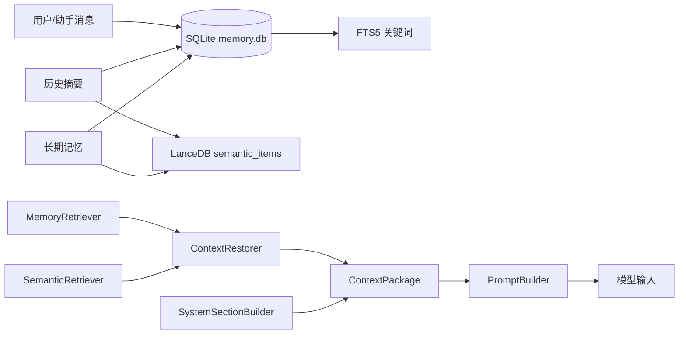

# 上下文压缩与持久化（M6）

M6 将 Agent 的「短期对话 + 长期记忆 + 重启恢复」做成可持久化子系统，避免长任务撑爆上下文窗口。实现遵循 `M6_Context_Persistence_Implementation_Spec.md`：**`systemSections`、检索与恢复均由当前会话/数据库/项目上下文动态生成，不写死文本。**

## 存储架构



| 组件 | 路径 | 职责 |
| --- | --- | --- |
| SQLite | `data/agent_data/memory.db` | sessions / messages / summaries / memories / projects / tasks |
| FTS5 | 同上（虚拟表） | 关键词检索 messages、summaries、memories |
| LanceDB | `data/agent_data/lancedb/` | summary / memory 的 embedding（默认 **64** 维；维度损坏时自动重建表） |
| JSONL | `data/agent_data/logs/messages/` | 原始对话旁路日志 |
| JSONL | `data/agent_data/logs/context-errors.jsonl` | 异步索引失败记录 |

## 模块职责（按规格拆分）

| 模块 | 职责 |
| --- | --- |
| `ContextManager` | 门面：持久化、压缩、恢复、记忆、检索、AgentLoop 集成 |
| `MessageStore` | 原始消息；`is_summarized` / `summary_id` 标记已压缩消息 |
| `SummaryManager` | 未压缩消息 > **20** 条时生成 `chunk_summary`；维护 `session_summary` |
| `MemoryManager` / `MemoryExtractor` | 记忆写入/停用；从摘要规则抽取 `MemoryCandidate` |
| `MemoryRetriever` | 固定注入（全局偏好/项目/任务）+ 关键词 + 语义；评分合并去重 |
| `SemanticRetriever` | LanceDB 向量 + summaries/messages FTS（记忆检索由 MemoryRetriever 负责） |
| `ContextRestorer` | 收集数据，返回结构化 `ContextPackage`（不写死 system 文本） |
| `SystemSectionBuilder` | 将摘要/记忆/项目/任务/检索结果格式化为 `SystemSection[]` |
| `PromptBuilder` | 将 sections + 最近消息渲染为内部 `ChatMessage[]`；保留历史 `tool` 记录的真实角色，不在上下文层做 provider 兼容改写 |

### 记忆评分公式

```text
score = relevance × 0.45 + importance × 0.25 + confidence × 0.20 + recency × 0.10
```

### systemSections 类型

`user_preferences` / `session_summary` / `task_state` / **`current_plan`** / **`file_snippets`**（近期只读工具消息中的路径与代码预览）/ `project_context` / `relevant_memories` / `semantic_results` / `recent_tool_results` / `response_rules`

同一记忆不会在多个 section 重复注入（偏好已在「用户偏好」展示时，不再进入「相关长期记忆」）。

## 请求数据流

```text
用户输入 → MessageStore 持久化
        → ContextRestorer.restore(sessionId, userInput, projectId?, taskId?)
        → MemoryRetriever.retrieve() + SemanticRetriever.search()
        → SystemSectionBuilder.build() → ContextPackage
        → PromptBuilder.build() → ModelClient.chat()
        → 助手消息持久化 → MemoryExtractor（摘要后）→ SummaryManager.compressIfNeeded()
```

## 与对话接口集成

`POST /api/chat` 与 `POST /api/agent` 默认开启持久化（`persist: false` 可关闭）：

1. 自动创建或使用 `sessionId` 保存每轮 user/assistant 消息。
2. 调用前 `restoreContext` → `PromptBuilder` 组装摘要、记忆与最近 **10** 条未压缩消息。
3. Agent 回合结束 `finalizeTurn` 触发压缩与记忆抽取；大工具输出经 `compactToolOutput` 截断。
4. 响应返回 `sessionId`、`compressed`；无效 `sessionId` 会自动新建会话。

## HTTP API

| 方法 | 路径 | 说明 |
| --- | --- | --- |
| GET | `/api/context/sessions` | 会话列表 |
| POST | `/api/context/sessions` | 创建会话 `{ title?, projectId? }` |
| GET | `/api/context/sessions/:id` | 会话详情（messages / summaries） |
| PATCH | `/api/context/sessions/:id` | 修改会话标题 `{ title }` |
| DELETE | `/api/context/sessions/:id` | 删除会话及消息、摘要、会话级记忆、关联 tasks/runs |
| GET | `/api/context/sessions/:id/restore?q=&phase=` | 恢复上下文；返回 `phase` + `contextPackage` + `renderedPrompt`（调试快照，不持久化）。`phase` 默认 `pre_call`；`post_call` 用于助手回复已入库后的快照 |
| POST | `/api/context/sessions/:id/compress` | 手动触发压缩 |
| GET | `/api/context/search?q=&scope=&scopeId=&tags=` | 记忆检索；`tags` 为逗号分隔标签，至少命中其一 |
| GET | `/api/context/memories` | 列出记忆 |
| POST | `/api/context/memories` | 写入/更新记忆（key 或 value 去重） |
| POST | `/api/context/memories/:id/deactivate` | 停用记忆 `{ reason? }`（同步清理 FTS / 向量索引） |

`contextPackage` 为**唯一**结构化上下文对象。其中 `messages` 为 `ContextMessage[]`（含 `id` / `createdAt` / `role` / `content`），便于摘要、压缩与去重排查。

每个 `systemSections[].items[]` 可含 **`tags`**（如 `memory:preference`、`code-fragment`、`ext:ts`、`section:file_snippets`）。`contextPackage.taggedFragments` 为扁平化带标签片段列表，便于按标签过滤与重组上下文。

标签推断见 `src/context/contextTags.ts`：记忆按 `memoryType` + scope；摘要按 `summaryType` 与结构化字段；文件片段按工具名、扩展名与语言；计划/任务按状态。压缩摘要与 `finalizeTurn` 会将片段写入 LanceDB 向量索引（含 tags）。

`renderedPrompt` 仅用于模型调用与调试（`systemSectionsText` + `finalMessages`），由 `PromptBuilder` 只读渲染，**不写回** `contextPackage`，**不持久化**。

持久化消息允许保留 `role=tool`，用于 `recent_tool_results`、`file_snippets`、审计和摘要；这类消息属于 AgentRelay 自定义 ReAct 协议的历史结果。恢复历史会话继续发消息时，`renderedPrompt.finalMessages` 会继续保留内部 `tool` 角色，真实 provider 兼容只发生在 `ModelClient` 发送前的 `messageBoundary`：内部 `tool` 会渲染为带 `Source: tool` 说明的 `system` 文本，防止兼容端点因缺少前置 `assistant.tool_calls` 返回 400，同时避免把工具结果伪装成用户消息。

**阶段约定**：
- `pre_call`：`saveUserMessage` 之后、模型调用之前；`finalMessages` 仅含 system + 历史 + 当前 user，**不含本次 assistant**。
- `post_call`：`saveAssistantMessage` 之后；`finalMessages` 可含刚入库的 assistant。

消息写入请使用 `saveUserMessage` / `saveAssistantMessage` / `saveToolMessage`，勿在模型返回前写入 assistant。

## 测试台

侧栏 **历史会话**：点击恢复；点击 **⋯** 在条目旁弹出菜单（重命名 / 删除），重命名与删除确认均在原地小面板完成，不使用浏览器 `alert/confirm/prompt`；删除会级联清除消息与关联运行记录。

网页用例见 `public/test-cases/m6-context.json`。

## 自检

```bash
cd agent-relay
npm run test:context   # 18 项，无需网络
npm test               # 全量 66 项
```

## 后续（未在本版实现）

- 多模态附件元数据表与 OCR。

`daily_summary` 已由 M8 `config.scheduler.dailySummaryCron` 注册 cron 触发器（写入通知队列，只读 goal）。
- 每轮 `finalizeTurn` 会从近期 user 消息规则抽取偏好并 `upsert`；压缩后从摘要再抽取。
- 生产环境可注入 `createLlmMemoryExtractor(chat)` 与 `createLlmSummarize(chat)`。
