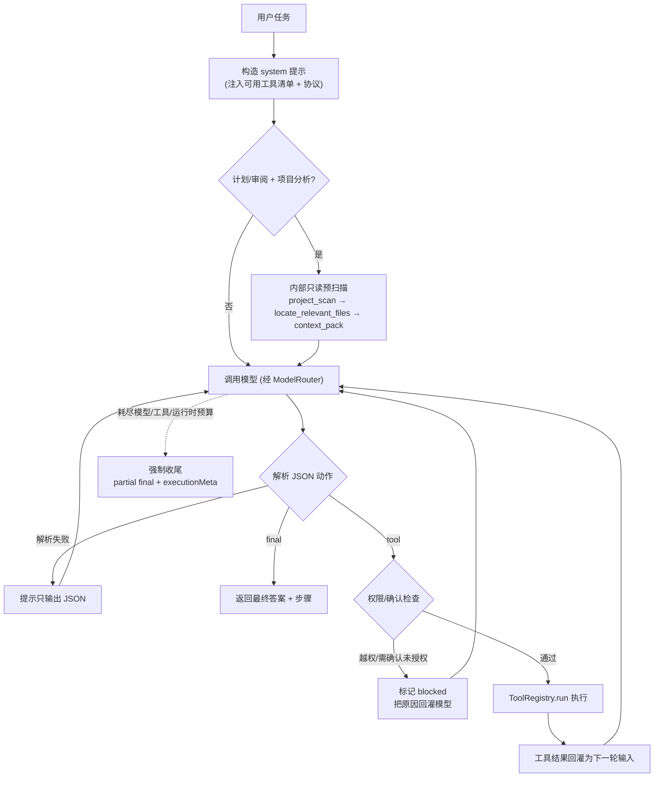

# 对话循环（Agent Loop）

对话循环是 Agent 的「大脑主回路」（里程碑 M1）：模型根据用户任务**自主决定**调用哪个工具、看结果、再决定下一步，直到给出最终答案。它把模型层、工具系统、权限边界串成一个可运行的闭环。

## 为什么用 ReAct 风格 JSON 协议

不同后端（Ollama 本地、OpenAI / DeepSeek / Anthropic 远程）对原生 function-calling 的支持参差不齐。为保证**本地与远程都能用**，本项目不依赖各家原生工具调用，而是约定一个简单可移植的协议：模型每轮只输出**一个 JSON 动作**。

- 调用工具：`{"action":"tool","tool":"工具名","input":{...},"thought":"原因"}`
- 给出答案：`{"action":"final","answer":"最终中文回答"}`

解析端做了健壮处理：从夹杂文本/代码围栏中提取首个平衡的 JSON 对象；解析失败会提示模型重输出，不会直接崩。

## 运行流程



## 安全与边界

- **运行策略**：`RunPolicy` 会根据显式 `mode` 或用户消息推断 `chat` / `plan` / `implement` / `debug` / `review`。`mode` 主要决定工作流、默认预算与提示语；工具权限由用户侧 `permissionPolicy` 推导。计划/审阅类请求默认推断为 `readOnly`，不依赖提示词自觉。
- **内部意图元信息**：`IntentRouter` 会先推断 `answer` / `plan` / `edit` / `run` / `verify` / `refactor` 等内部意图，再兼容映射到当前运行模式；`WorkflowRouter` 负责把 `intent` 映射为 `workflowType` 与后续执行器标识。`executionMeta.modeSource`、`executionMeta.intent`、`executionMeta.workflowType` 会返回给前端与审计链路，测试台 Agent 结果卡会把 `workflowType` 展示为“计划生成中 / 正在验证结果 / 正在修改文件”等当前内部处理状态。
- **用户侧权限策略与 PermissionGuard**：`POST /api/agent` 可传 `permissionPolicy: "readOnly" | "confirmBeforeEdit" | "autoEdit" | "confirmBeforeRun" | "autoRun"`；未传时 `RunPolicyManager` 会按内部意图与 `autoConfirm` 保守推断，并在 `executionMeta.permissionPolicy` / `permissionPolicySource` 返回。`RunPolicy.allowedPermissions` 由 `permissionPolicy` 推导：`readOnly` 只暴露 read，`autoEdit`/`confirmBeforeEdit` 暴露 read+write，`autoRun`/`confirmBeforeRun` 暴露完整工具权限；`mode` 不再直接决定能否写文件或执行命令。AgentLoop 在每次工具调用前通过 `PermissionGuard` 结合 `intent`、`permissionPolicy`、工具权限与有效允许集输出 `allow` / `needsConfirmation` / `deny`；被阻塞步骤会带 `confirmationRequest`，包含操作说明、影响文件/命令/网络目标、风险摘要与 `waiting_confirmation` / `denied` 状态。即使用户选择 `autoEdit` / `autoRun`，删除/清空、提交或推送、执行未知远程脚本、修改系统环境、安装全局依赖、读取/写入疑似密钥等高风险行为也会强制返回 `needsConfirmation`。项目/角色/用户显式授权交集仍是硬上限，Shell/Network/路径策略仍在工具层继续兜底。
- **WorkflowRouter / WorkflowPlanner + 内部预扫描**：`WorkflowRouter` 负责 intent → 工作流执行器的稳定映射；`answerWorkflow` / `summarizeWorkflow` / `searchWorkflow` 声明工具层强制只读，即使调用方显式传入 `autoEdit` / `autoRun` 也只暴露 read 工具。`WorkflowPlanner` 负责在对应模式和目标下选择 `plan_prescan` / `implement_locate` 等确定性预扫描计划；`WorkflowExecutor` 是模型首轮前的统一调度入口，目前挂接 `PlanWorkflow` 和 `RunVerifyWorkflow`，让 `AgentLoop` 只接收新增步骤与模型上下文。`PlanReportWorkflow` 是 `/api/plans/analyze` 的 planWorkflow 用户报告入口：调用只读 Agent 生成 Markdown，并通过 `PlanService.saveUserVisiblePlan` 保存 `UserVisiblePlan`，不直接执行。`TaskExecutionWorkflow` 是已审批计划执行入口：统一封装 `TaskRunner`、`ToolStepExecutor` 与 `DryRunExecutor` 装配，供执行和 resume 复用。`PlanWorkflow` 作为内部执行器确定性执行只读工具链，不会作为 `ToolRegistry` 工具名暴露给模型调用。`RunVerifyWorkflow` 会在 `runWorkflow` / `verifyWorkflow` 中识别白名单安全命令（如 `node --version`、`npm --version`、`npm run typecheck`、`npm test`、`npm run build`），在 shell 权限和预算允许时先执行 `shell_run` 并把输出注入模型上下文；没有安全命令、权限或预算时降级为静态检查说明。
- **权限集**：循环按 `permissionPolicy` 或显式 `allowedPermissions` 向模型暴露工具，并在执行前再次校验；显式 `allowedPermissions` 只能收窄，不能扩权。
- **副作用确认**：`write_file` / `shell_run` 等高风险工具，未开启 `autoConfirm` 时会被**阻塞**（把原因告诉模型，让它换只读方案或直接作答）——非交互循环里这样更安全。
- **命令风险拦截**：`shell_run` 仍受命令风险分级保护，高危命令直接被拦。
- **运行预算**：`RunPolicy` 按模式分配 `maxModelTurns`、`maxToolCalls`、`maxReadCalls`、`maxWriteCalls`、`maxShellCalls`、`maxRuntimeMs`，分别限制模型轮次、工具请求、读写命令次数与总运行时长。
- **相关文件定位**：需要找文件时优先使用 `project_scan` / `locate_relevant_files` / `context_pack`，避免连续低层 `list_files` / `search_text` / `read_file` 消耗主 Agent 预算。
- **历史工具消息协议隔离**：AgentRelay 的工具执行结果是自定义 ReAct JSON 协议记录，不是 OpenAI 原生 `tool_calls`。历史会话恢复时，`PromptBuilder` 会把持久化的 `role=tool` 消息渲染为普通 `user` 历史文本，再发给模型，避免 DeepSeek/OpenAI-compatible 服务报 `Messages with role 'tool' must be a response to a preceding message with 'tool_calls'`。
- **预算耗尽收尾**：达到上限时不再只返回“未得到最终答案”，而是停止继续调用工具，基于已完成步骤输出部分结论、缺失信息、建议预算，并明确本轮是否执行写入类工具。
- **每轮决策 trace**：模型输出被解析后会写入 `agent_decision` trace 事件，记录 `tool` / `final` / `parse_error`、迭代轮次、工具名、thought、输入预览或 final 长度，供 `/api/trace/replay` 复盘。
- **模型用量 trace**：每个模型 turn 写入 `agent_model_turn` 摘要；运行结束写入 `run_usage_summary`，汇总 token、耗时、费用、错误数和预算使用，不保存完整模型输出。

## 返回结构

```ts
interface AgentRunResult {
  answer: string;            // 最终回答
  steps: AgentToolStep[];    // 每次工具调用：tool/input/thought/ok/output/error/durationMs/blocked
  iterations: number;        // 实际迭代轮数
  reachedLimit: boolean;     // 是否因达上限而结束
  executionMeta: {
    mode: "chat" | "plan" | "implement" | "debug" | "review";
    modeSource?: "explicit" | "inferred";
    intent?: "answer" | "plan" | "edit" | "run" | "debug" | "review" | "verify" | "summarize" | "search" | "refactor" | "generate_file";
    workflowType?: string;
    permissionPolicy?: "readOnly" | "confirmBeforeEdit" | "autoEdit" | "confirmBeforeRun" | "autoRun";
    permissionPolicySource?: "explicit" | "inferred";
    budget: {
      maxModelTurns: number;
      maxToolCalls: number;
      maxReadCalls: number;
      maxWriteCalls: number;
      maxShellCalls: number;
      maxRuntimeMs: number;
    };
    usage: {
      modelTurns: number;
      toolCalls: number;
      readCalls: number;
      writeCalls: number;
      shellCalls: number;
      runtimeMs: number;
    };
    budgetExhausted?: "maxModelTurns" | "maxToolCalls" | "maxReadCalls" | "maxWriteCalls" | "maxShellCalls" | "maxRuntimeMs";
    location?: {
      usedLocateSteps: number;
      usedSearchCalls: number;
      usedListCalls: number;
      usedReadForLocationCalls: number;
      locatedFiles: string[];
      candidateFiles: string[];
      stopReason?: string;
      needsContinue: boolean;
      confidence?: number;
    };
    usedIterations: number;
    usedModelTurns: number;
    usedToolCalls: number;
    usedReadCalls: number;
    usedWriteCalls: number;
    usedShellCalls: number;
    stopReason: "completed" | "budget_exhausted" | "error" | "user_cancelled";
    needsMoreBudget: boolean;
    suggestedBudget?: AgentExecutionMeta["budget"];
  };
}
```

`AgentToolStep.confirmationRequest` 仅在确认门阻塞或策略拒绝时出现，用于 UI 与审计展示：`title/message/action` 描述将要做什么，`affects.files/commands/networkTargets` 描述影响范围，`risk` 描述风险等级、分类和原因。

## HTTP 接口与测试台

| 方法 | 路径 | 说明 |
| --- | --- | --- |
| POST | `/api/agent` | 入参 `{ message, system?, mode?, permissionPolicy?, sensitive?, autoConfirm?, budget? }`，返回 `AgentRunResult` |

测试台顶部「模式」选择「智能体」即进入自主模式：会逐条展示工具调用（输入/结果/耗时）、`executionMeta` 和最终回答；勾选「允许改动（写/命令）」即开启 `autoConfirm`。选择「计划报告」会调用 `/api/agent` 并显式传入 `mode: "plan"`，用于生成给用户看的只读 Markdown 分析；机器可执行计划草案仍由 `/api/plan` / `/api/plans/draft` 生成。计划模式也会从“计划模式/只读/不要修改”等描述中推断。

## 示例

```text
用户：读取 package.json 并只告诉我项目的 name 字段值
Agent：{"action":"tool","tool":"read_file","input":{"path":"package.json"}}
（工具返回文件内容）
Agent：{"action":"final","answer":"name 字段值为 agent-relay"}
```

## 自检

```bash
npm run test:loop   # 假 chat 驱动：工具→最终 / onStep / agent_decision / WorkflowExecutor / 分项预算耗尽收尾 / 定位统计 / 计划模式限写 / 未知工具不崩
npm run test:workflow-executor
npm run test:run-verify-workflow
```

## 已知边界 / 下一步

- **流式推送**：`POST /api/agent/stream` 以 SSE 推送 `run_start` / `step` / `done`（`AgentLoop.onStep`）；原 `POST /api/agent` 仍一次性返回 JSON。
- 交互式逐工具确认仍未做（用 `autoConfirm` 开关替代）。
- 未做上下文压缩，长对话会随轮数增长——后续里程碑处理。
