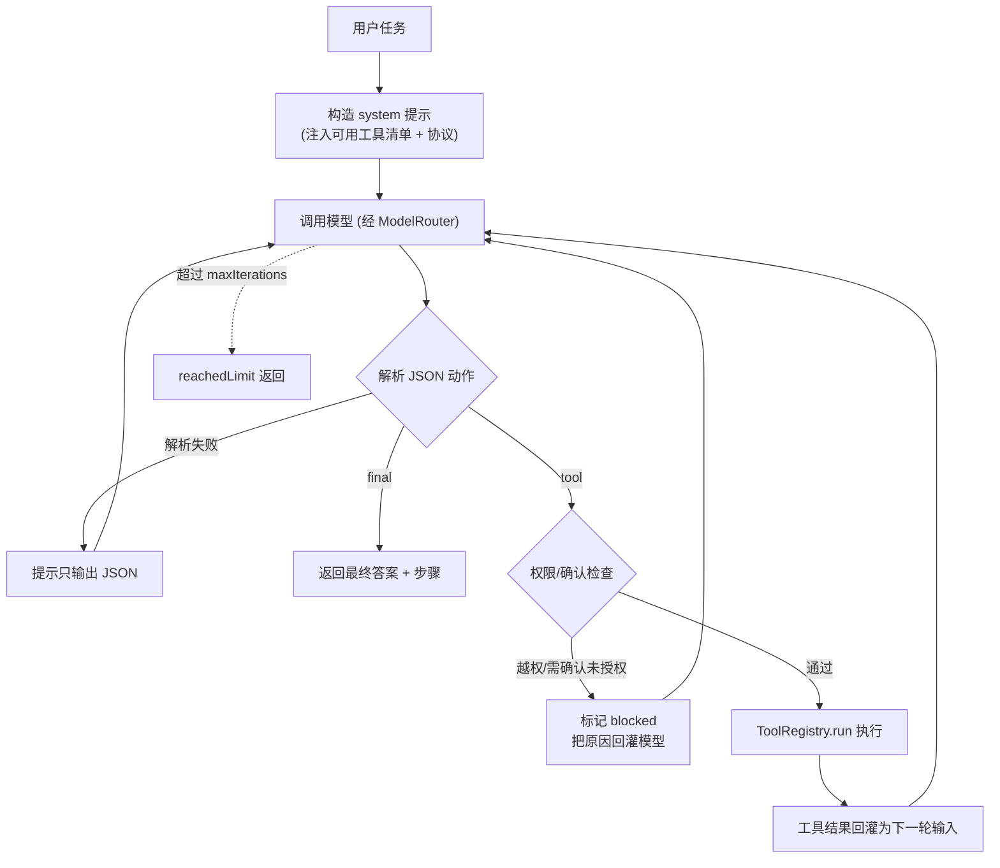

# 对话循环（Agent Loop）

对话循环是 Agent 的「大脑主回路」（里程碑 M1）：模型根据用户任务**自主决定**调用哪个工具、看结果、再决定下一步，直到给出最终答案。它把模型层、工具系统、权限边界串成一个可运行的闭环。

## 为什么用 ReAct 风格 JSON 协议

不同后端（Ollama 本地、OpenAI / DeepSeek / Anthropic 远程）对原生 function-calling 的支持参差不齐。为保证**本地与远程都能用**，本项目不依赖各家原生工具调用，而是约定一个简单可移植的协议：模型每轮只输出**一个 JSON 动作**。

- 调用工具：`{"action":"tool","tool":"工具名","input":{...},"thought":"原因"}`
- 给出答案：`{"action":"final","answer":"最终中文回答"}`

解析端做了健壮处理：从夹杂文本/代码围栏中提取首个平衡的 JSON 对象；解析失败会提示模型重输出，不会直接崩。

## 运行流程



## 安全与边界

- **权限集**：循环按 `allowedPermissions`（默认任务模式全集）向模型暴露工具，并在执行前再次校验。
- **副作用确认**：`write_file` / `shell_run` 等高风险工具，未开启 `autoConfirm` 时会被**阻塞**（把原因告诉模型，让它换只读方案或直接作答）——非交互循环里这样更安全。
- **命令风险拦截**：`shell_run` 仍受命令风险分级保护，高危命令直接被拦。
- **迭代上限**：`maxIterations`（默认 8）防止无限循环。

## 返回结构

```ts
interface AgentRunResult {
  answer: string;            // 最终回答
  steps: AgentToolStep[];    // 每次工具调用：tool/input/thought/ok/output/error/durationMs/blocked
  iterations: number;        // 实际迭代轮数
  reachedLimit: boolean;     // 是否因达上限而结束
}
```

## HTTP 接口与测试台

| 方法 | 路径 | 说明 |
| --- | --- | --- |
| POST | `/api/agent` | 入参 `{ message, system?, sensitive?, autoConfirm?, maxIterations? }`，返回 `AgentRunResult` |

测试台顶部「模式」选择「智能体」即进入自主模式：会逐条展示工具调用（输入/结果/耗时）和最终回答；勾选「允许改动（写/命令）」即开启 `autoConfirm`。

## 示例

```text
用户：读取 package.json 并只告诉我项目的 name 字段值
Agent：{"action":"tool","tool":"read_file","input":{"path":"package.json"}}
（工具返回文件内容）
Agent：{"action":"final","answer":"name 字段值为 agent-relay"}
```

## 自检

```bash
npm run test:loop   # 假 chat 驱动：工具→最终 / 迭代上限 / 限写阻塞 / 未知工具不崩（6 项）
```

## 已知边界 / 下一步

- 暂未做流式逐步推送（结果一次性返回）；交互式逐工具确认也未做（用 `autoConfirm` 开关替代）。
- 未做上下文压缩，长对话会随轮数增长——后续里程碑处理。
