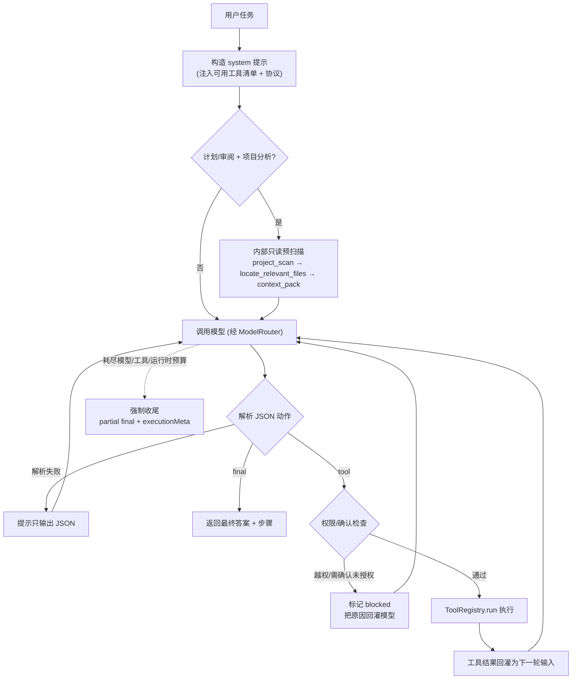

# 对话循环（Agent Loop）

对话循环是 Agent 的「大脑主回路」（里程碑 M1）：模型根据用户任务**自主决定**调用哪个工具、看结果、再决定下一步，直到给出最终答案。它把模型层、工具系统、权限边界串成一个可运行的闭环。

## 为什么用 ReAct 风格 JSON 协议

不同后端（Ollama 本地、OpenAI / DeepSeek / Anthropic 远程）对原生 function-calling 的支持参差不齐。为保证**本地与远程都能用**，本项目不依赖各家原生工具调用，而是约定一个简单可移植的协议：模型每轮只输出**一个 JSON 动作**。

- 调用工具：`{"action":"tool","tool":"工具名","input":{...},"thought":"原因"}`
- 给出答案：`{"action":"final","answer":"最终中文回答"}`

解析端做了健壮处理：从夹杂文本/代码围栏中提取首个平衡的 JSON 对象；解析失败会提示模型重输出，不会直接崩。

## 运行流程



## 安全与边界

- **运行策略**：`RunPolicy` 会根据显式 `mode` 或用户消息推断 `chat` / `plan` / `implement` / `debug` / `review`。`mode` 主要决定工作流、默认预算与提示语；工具权限由用户侧 `permissionPolicy` 推导。计划/审阅类请求默认推断为 `readOnly`，不依赖提示词自觉。
- **内部意图元信息**：`IntentRouter` 会先推断 `answer` / `plan` / `edit` / `run` / `verify` / `refactor` 等内部意图，再兼容映射到当前运行模式；`WorkflowRouter` 负责把 `intent` 映射为 `workflowType` 与后续执行器标识。`executionMeta.modeSource`、`executionMeta.intent`、`executionMeta.workflowType` 会返回给前端与审计链路，测试台 Agent 结果卡会把 `workflowType` 展示为“计划生成中 / 正在验证结果 / 正在修改文件”等当前内部处理状态。
- **用户侧权限策略与 PermissionGuard**：`POST /api/agent` 可传 `permissionPolicy: "readOnly" | "confirmBeforeEdit" | "autoEdit" | "confirmBeforeRun" | "autoRun"`；未传时 `RunPolicyManager` 会按内部意图与 `autoConfirm` 保守推断，并在 `executionMeta.permissionPolicy` / `permissionPolicySource` 返回。`RunPolicy.allowedPermissions` 由 `permissionPolicy` 推导：`readOnly` 只暴露 read，`autoEdit`/`confirmBeforeEdit` 暴露 read+write，`autoRun`/`confirmBeforeRun` 暴露完整工具权限；`mode` 不再直接决定能否写文件或执行命令。AgentLoop 在每次工具调用前通过 `PermissionGuard` 结合 `intent`、`permissionPolicy`、工具权限与有效允许集输出 `allow` / `needsConfirmation` / `deny`；被阻塞步骤会带 `confirmationRequest`，包含操作说明、影响文件/命令/网络目标、风险摘要与 `waiting_confirmation` / `denied` 状态。即使用户选择 `autoEdit` / `autoRun`，删除/清空、提交或推送、执行未知远程脚本、修改系统环境、安装全局依赖、读取/写入疑似密钥等高风险行为也会强制返回 `needsConfirmation`。项目/角色/用户显式授权交集仍是硬上限，Shell/Network/路径策略仍在工具层继续兜底。
- **WorkflowRouter / WorkflowPlanner + 内部预扫描**：`WorkflowRouter` 负责 intent → 工作流执行器的稳定映射；`answerWorkflow` / `summarizeWorkflow` / `searchWorkflow` 声明工具层强制只读，即使调用方显式传入 `autoEdit` / `autoRun` 也只暴露 read 工具。`WorkflowPlanner` 负责在对应模式和目标下选择 `plan_prescan` / `edit_locate` / `generate_file_locate` / `debug_locate` / `implement_locate` 等确定性预扫描计划；`WorkflowExecutor` 是模型首轮前的统一调度入口，目前挂接 `PlanWorkflow`、`DebugAnalysisWorkflow`、`RefactorPlanWorkflow`、`ImplicitPlanWorkflow`、`EditProposalWorkflow` 和 `RunVerifyWorkflow`，让 `AgentLoop` 只接收新增步骤与模型上下文。`debugWorkflow` 会先执行 `locate_relevant_files` + `context_pack` 只读定位，再由 `DebugAnalysisWorkflow` 注入 analysis phase，要求模型先覆盖 `errorSummary`、`suspectedFiles`、`rootCauseHypotheses`、`minimalFixPlan`、`verificationPlan` 与 `riskAndRollback`，并把结构化契约写入 `executionMeta.workflowDebugAnalyses`；该阶段不写文件，真正修复仍要经过常规工具、`PermissionGuard`、工具风险与预算边界。`refactorWorkflow` 会先执行 `project_scan` + `locate_relevant_files` + `context_pack` 只读预扫描，再由 `RefactorPlanWorkflow` 注入 plan phase，要求模型先覆盖 `scopeSummary`、`affectedModules`、`stagedChanges`、`perStageVerification` 与 `riskAndRollback`，并把结构化契约写入 `executionMeta.workflowRefactorPlans`；分阶段写入后复用写后验证与修正链路，要求每阶段验证后再进入下一阶段。复杂副作用任务（未显式进入计划模式）会由 `ImplicitPlanWorkflow` 注入内部轻量计划（`userVisiblePlanMode: false`），记录到 `executionMeta.workflowInternalPlans`；同一会话后续消息若意图变化，`WorkflowSessionSwitch` 会注入切换上下文并在 `executionMeta.workflowSwitch` 返回 from/to 记录；运行结束会在 `executionMeta.workflowTaskState` 返回统一任务状态（`idle` / `planning` / `waiting_confirmation` / `executing` / `verifying` / `completed` / `failed` / `cancelled`），测试台优先展示该状态标签。`editWorkflow` / `generateFileWorkflow` 会先执行 `locate_relevant_files` + `context_pack` 只读预定位，再由 `EditProposalWorkflow` 注入写入前 proposal phase，要求模型在调用写工具前明确 `targetFiles`、`changeSummary`、`permissionCheck`、`diffPlan` 与 `verificationPlan`；同时 `AgentLoop` 会把该阶段的结构化契约写入 `executionMeta.workflowProposals`，其中 `permissionChecks` 会复用 `PermissionGuard` 对 `apply_patch` / `write_file` 做写入前预检，便于 UI、日志与测试读取 proposal 所属工作流、权限策略、必填字段和写入确认判断；成功执行 `write_file` / `apply_patch` 后，还会把 `path`、`changeId`、hash 与截断 diff 汇总到 `executionMeta.workflowDiffs`，并由 `EditExecutionWorkflow` 注入 execution phase 上下文，要求模型基于真实 diff 做最小验证或最终总结；如果写工具返回目标路径，`EditAutoVerificationWorkflow` 会规划只读 `read_file`，由 `AgentLoop` 通过既有权限、预算与工具链路自动读回刚写入文件；当 `read_file` / `diff_file` / `shell_run` 等验证工具完成后，`EditVerificationWorkflow` 会注入 verification phase，并把验证工具、状态、错误与输出预览写入 `executionMeta.workflowVerifications`，引导模型验证通过则 final、失败则进入 `WorkflowCorrectionWorkflow` 的 correction/termination phase，并把 `executionMeta.workflowCorrections` 返回给前端与审计链路（edit/generate-file/debug/refactor 共用，默认每路径最多 2 轮自动修正）；真正写入执行仍受 `PermissionGuard`、工具风险与预算约束；首次写入前由 `WorkflowWriteGate` 门控，`EditWriteWorkflow` / `DebugFixWorkflow` 在 proposal/analysis 与只读上下文就绪前阻塞 `write_file`/`apply_patch`，通过后注入 write/fix phase 并写入 `executionMeta.workflowWritePhases` / `workflowDebugFixes`。`PlanReportWorkflow` 是 `/api/plans/analyze` 的 planWorkflow 用户报告入口：调用只读 Agent 生成 Markdown，并通过 `PlanService.saveUserVisiblePlan` 保存 `UserVisiblePlan`，不直接执行。`PlanCompileWorkflow` 是 `/api/plans/:userVisiblePlanId/compile` 的 planWorkflow 编译入口：只把已确认 Todo 转成 awaiting_approval 内部计划草案，仍需审批后执行。`TaskExecutionWorkflow` 是已审批计划执行入口：统一封装 `TaskRunner`、`ToolStepExecutor` 与 `DryRunExecutor` 装配，供执行和 resume 复用。`PlanWorkflow` 和 `DebugAnalysisWorkflow` 作为内部执行器不会作为 `ToolRegistry` 工具名暴露给模型调用。`RunVerifyWorkflow` 会在 `runWorkflow` / `verifyWorkflow` 中识别白名单安全命令（如 `node --version`、`npm --version`、`npm run typecheck`、`npm test`、`npm run build`），在 shell 权限和预算允许时先执行 `shell_run` 并把输出注入模型上下文；没有安全命令、权限或预算时降级为静态检查说明。
- **WorkflowStateCenter + WorkflowWriteGate**：自动工作流的控制流不再靠各工作流互相调用推进，而是由 `WorkflowStateCenter` 从 plan/write/verify/correction 事件派生 `executionMeta.workflowState`。`WorkflowWriteGate` 读取该状态后统一约束 edit/generate-file/debug/refactor 写入：缺少 proposal/analysis/staged plan 或只读上下文时阻塞首次写入；写入成功后进入 `write_pending_verification`，必须先完成验证才能继续下一次写入；验证失败时允许在上限内做最小修正，达到默认 2 次失败即进入 `terminated` 并禁止继续写入。架构测试只禁止 value import 形成的控制流循环，允许纯类型/数据层引用继续存在。
- **权限集**：循环按 `permissionPolicy` 或显式 `allowedPermissions` 向模型暴露工具，并在执行前再次校验；显式 `allowedPermissions` 只能收窄，不能扩权。
- **副作用确认**：`write_file` / `shell_run` 等高风险工具，未开启 `autoConfirm` 时会被**阻塞**（把原因告诉模型，让它换只读方案或直接作答）——非交互循环里这样更安全。
- **命令风险拦截**：`shell_run` 仍受命令风险分级保护，高危命令直接被拦。
- **运行预算**：`RunPolicy` 按模式分配 `maxModelTurns`、`maxToolCalls`、`maxReadCalls`、`maxWriteCalls`、`maxShellCalls`、`maxRuntimeMs`，分别限制模型轮次、工具请求、读写命令次数与总运行时长。
- **相关文件定位**：需要找文件时优先使用 `project_scan` / `locate_relevant_files` / `context_pack`，避免连续低层 `list_files` / `search_text` / `read_file` 消耗主 Agent 预算。
- **子 Agent 调度**：主 Agent 可通过 `dispatch_subagent` 将可独立推进的子步骤委派为 `tasks: DelegatedTask[]`；子 Agent 接收目标、约束、最小上下文与可用工具后独立执行，主 Agent 判断是否采纳并合并多个结构化结果。用户明确要求 N 个子 Agent 时，主 Agent 应一次传入 N 个独立 `tasks`，禁止使用旧 `roles` / `task` 字符串或固定角色名。非工程任务默认不读取项目文件；只有明确涉及当前项目、代码、文件、测试或命令时才使用项目定位工具。写操作须 `toolPolicy.writeAllowed` 且 `grantedPermissions` 含 `write`；派生深度受 `security.subagent.maxDispatchDepth` 约束（默认 1）。已收集 3 个成功子 Agent 结果后阻止继续派生并要求 `final`。子 Agent 完成后写入 `NotificationQueue`（`source=subagent`）。
- **历史工具消息协议隔离**：AgentRelay 的工具执行结果是自定义 ReAct JSON 协议记录，不是 OpenAI 原生 `tool_calls`。历史会话恢复时，`PromptBuilder` 会把持久化的 `role=tool` 消息渲染为普通 `user` 历史文本，再发给模型，避免 DeepSeek/OpenAI-compatible 服务报 `Messages with role 'tool' must be a response to a preceding message with 'tool_calls'`。
- **预算耗尽收尾**：达到上限时不再只返回“未得到最终答案”，而是停止继续调用工具，基于已完成步骤输出部分结论、缺失信息、建议预算，并明确本轮是否执行写入类工具。
- **每轮决策 trace**：模型输出被解析后会写入 `agent_decision` trace 事件，记录 `tool` / `final` / `parse_error`、迭代轮次、工具名、thought、输入预览或 final 长度，供 `/api/trace/replay` 复盘。
- **动作 JSON 与回答 Markdown 分离**：ReAct 外层协议只识别最外层 `{"action":"tool"}` / `{"action":"final"}` 动作对象；`final.answer` 是普通 Markdown，可以包含 ```json、```ts 等代码块。解析器不会再优先抽取第一个 Markdown fence，因为那会把回答里的示例代码误当作动作 JSON，导致无意义 `parse_error` 循环；兜底逻辑会按完整输出、字符串化动作、平衡 JSON 候选依次解析。
- **模型用量 trace**：每个模型 turn 写入 `agent_model_turn` 摘要；运行结束写入 `run_usage_summary`，汇总 token、耗时、费用、错误数和预算使用，不保存完整模型输出。

## 权限续跑与历史持久化边界

计划批准后的续跑只会在首条 `system` 消息中追加运行态 handoff 约束，明确要求下一轮输出 ReAct JSON；系统不会向 `messages` 注入合成的 `role=user` “继续执行”消息，也不会把这类运行态提示保存成用户历史。若模型在 handoff 后先输出普通文本（例如“好的，开始执行”），该文本只留在本轮内存对话中用于纠偏，会产生 `parse_error` trace，但不会调用 `saveAssistantMessage` 写入持久化会话历史；只有成功解析为 `tool` / `final` 的 ReAct 动作才会保存为 assistant 历史。

`write_file` 用于新建嵌套路径文件时，即使模型误传 `createDirs:false`，工具层也会在确认目标文件原本不存在且写入失败原因为 `ENOENT` 时自动补建父目录并重试一次，避免把可恢复的路径创建问题消耗成额外迭代。

## 返回结构

```ts
interface AgentRunResult {
  answer: string;            // 最终回答
  steps: AgentToolStep[];    // 每次工具调用：tool/input/thought/ok/output/error/durationMs/blocked
  iterations: number;        // 实际迭代轮数
  reachedLimit: boolean;     // 是否因达上限而结束
  executionMeta: {
    mode: "chat" | "plan" | "implement" | "debug" | "review";
    modeSource?: "explicit" | "inferred";
    intent?: "answer" | "plan" | "edit" | "run" | "debug" | "review" | "verify" | "summarize" | "search" | "refactor" | "generate_file";
    workflowType?: string;
    permissionPolicy?: "readOnly" | "confirmBeforeEdit" | "autoEdit" | "confirmBeforeRun" | "autoRun";
    permissionPolicySource?: "explicit" | "inferred";
    workflowProposals?: Array<{
      workflowType: "editWorkflow" | "generateFileWorkflow";
      phase: "proposal";
      goal: string;
      intent: "edit" | "generate_file";
      permissionPolicy: "readOnly" | "confirmBeforeEdit" | "autoEdit" | "confirmBeforeRun" | "autoRun";
      requiredFields: string[];
      writeAllowedByPolicy: boolean;
      requiresConfirmationBeforeWrite: boolean;
      permissionSummary: "write_allowed" | "confirmation_required" | "denied";
      permissionChecks: Array<{
        toolName: "apply_patch" | "write_file";
        permission: "write";
        decision: "allow" | "needsConfirmation" | "deny";
        reason?: string;
      }>;
    }>;
    workflowDebugAnalyses?: Array<{
      workflowType: "debugWorkflow";
      phase: "analysis";
      goal: string;
      intent: "debug";
      permissionPolicy: "readOnly" | "confirmBeforeEdit" | "autoEdit" | "confirmBeforeRun" | "autoRun";
      requiredFields: string[];
      suggestedTools: string[];
      writeAllowedByPolicy: boolean;
      requiresConfirmationBeforeWrite: boolean;
    }>;
    workflowDiffs?: Array<{
      toolCallId?: string;
      tool: "write_file" | "apply_patch";
      path?: string;
      changeId?: string;
      beforeHash?: string;
      afterHash?: string;
      diff?: string;
      diffTruncated: boolean;
    }>;
    workflowDebugAnalyses?: Array<{
      workflowType: "debugWorkflow";
      phase: "analysis";
      goal: string;
      intent: "debug";
      permissionPolicy: string;
      requiredFields: string[];
      writeAllowedByPolicy: boolean;
      requiresConfirmationBeforeWrite: boolean;
    }>;
    workflowRefactorPlans?: Array<{
      workflowType: "refactorWorkflow";
      phase: "plan";
      goal: string;
      intent: "refactor";
      permissionPolicy: string;
      requiredFields: string[];
      maxStages: number;
      writeAllowedByPolicy: boolean;
      requiresConfirmationBeforeWrite: boolean;
    }>;
    workflowInternalPlans?: Array<{
      workflowType: string;
      phase: "implicit";
      goal: string;
      intent: string;
      permissionPolicy: string;
      requiredFields: string[];
      complexitySignals: string[];
      userVisiblePlanMode: false;
      maxSteps: number;
    }>;
    workflowTaskState?:
      | "idle"
      | "planning"
      | "waiting_confirmation"
      | "executing"
      | "verifying"
      | "completed"
      | "failed"
      | "cancelled";
    workflowState?: {
      workflowType: string;
      phase:
        | "idle"
        | "planning"
        | "write_ready"
        | "write_pending_verification"
        | "verification_passed"
        | "correction_allowed"
        | "terminated";
      taskState: string;
      priorWrites: number;
      readToolsBeforeWrite: number;
      requiresVerificationBeforeNextWrite: boolean;
      correctionLimitReached: boolean;
      failedVerificationAttempts: number;
      maxCorrectionAttempts: number;
      planningReady: boolean;
    };
    workflowSwitch?: {
      switched: true;
      fromIntent: string;
      toIntent: string;
      fromWorkflowType: string;
      toWorkflowType: string;
      fromTaskState?: string;
      sequence: number;
    };
    workflowWritePhases?: Array<{
      workflowType: "editWorkflow" | "generateFileWorkflow";
      phase: "write";
      writeTool: "write_file" | "apply_patch";
      proposalReady: boolean;
      readToolsBeforeWrite: number;
    }>;
    workflowDebugFixes?: Array<{
      workflowType: "debugWorkflow";
      phase: "fix";
      writeTool: "write_file" | "apply_patch";
      analysisReady: boolean;
      readToolsBeforeWrite: number;
    }>;
    workflowVerifications?: Array<{
      workflowType: "editWorkflow" | "generateFileWorkflow" | "debugWorkflow" | "refactorWorkflow";
      writeToolCallId?: string;
      writeTool: "write_file" | "apply_patch";
      path?: string;
      changeId?: string;
      verificationToolCallId?: string;
      verificationTool: string;
      ok: boolean;
      blocked?: boolean;
      error?: string;
      outputPreview?: string;
    }>;
    workflowCorrections?: Array<{
      workflowType: "editWorkflow" | "generateFileWorkflow" | "debugWorkflow" | "refactorWorkflow";
      phase: "correction" | "termination";
      path?: string;
      changeId?: string;
      verificationTool: string;
      attempt: number;
      maxAttempts: number;
      limitReached: boolean;
      verificationError?: string;
    }>;
    budget: {
      maxModelTurns: number;
      maxToolCalls: number;
      maxReadCalls: number;
      maxWriteCalls: number;
      maxShellCalls: number;
      maxRuntimeMs: number;
    };
    usage: {
      modelTurns: number;
      toolCalls: number;
      readCalls: number;
      writeCalls: number;
      shellCalls: number;
      runtimeMs: number;
    };
    budgetExhausted?: "maxModelTurns" | "maxToolCalls" | "maxReadCalls" | "maxWriteCalls" | "maxShellCalls" | "maxRuntimeMs";
    location?: {
      usedLocateSteps: number;
      usedSearchCalls: number;
      usedListCalls: number;
      usedReadForLocationCalls: number;
      locatedFiles: string[];
      candidateFiles: string[];
      stopReason?: string;
      needsContinue: boolean;
      confidence?: number;
    };
    usedIterations: number;
    usedModelTurns: number;
    usedToolCalls: number;
    usedReadCalls: number;
    usedWriteCalls: number;
    usedShellCalls: number;
    stopReason: "completed" | "budget_exhausted" | "error" | "user_cancelled";
    needsMoreBudget: boolean;
    suggestedBudget?: AgentExecutionMeta["budget"];
  };
}
```

`AgentToolStep.confirmationRequest` 仅在确认门阻塞或策略拒绝时出现，用于 UI 与审计展示：`title/message/action` 描述将要做什么，`affects.files/commands/networkTargets` 描述影响范围，`risk` 描述风险等级、分类和原因。

## HTTP 接口与测试台

| 方法 | 路径 | 说明 |
| --- | --- | --- |
| POST | `/api/agent` | 入参 `{ message, system?, mode?, permissionPolicy?, sensitive?, autoConfirm?, budget? }`，返回 `AgentRunResult` |

测试台主输入区已改为**统一自动工作流入口**：默认调用 `POST /api/agent` 并由 `IntentRouter` 自动推断意图与工作流，不再要求用户在「对话 / 计划 / 智能体」之间手动切换。输入区提供 `permissionPolicy` 五档权限策略下拉（只读 / 修改前确认 / 自动修改 / 命令前确认 / 自动执行）；「高级选项」可显式传入 `mode: chat/plan/implement/debug/review` 用于测试与强制边界。响应后用户消息旁会展示 `workflowType` / `workflowTaskState` / 工作流切换等内部状态标签；助手结果卡仍展示完整 `executionMeta`。

## 示例

```text
用户：读取 package.json 并只告诉我项目的 name 字段值
Agent：{"action":"tool","tool":"read_file","input":{"path":"package.json"}}
（工具返回文件内容）
Agent：{"action":"final","answer":"name 字段值为 agent-relay"}
```

## 自检

```bash
npm run test:loop   # 假 chat 驱动：工具→最终 / onStep / agent_decision / WorkflowExecutor / DebugAnalysisWorkflow / RefactorPlanWorkflow / EditExecutionWorkflow / EditAutoVerificationWorkflow / EditVerificationWorkflow / WorkflowCorrectionWorkflow / WorkflowStateCenter 元信息 / 分项预算耗尽收尾 / 定位统计 / 计划模式限写 / 未知工具不崩
npm run test:workflow-state-center
npm run test:workflow-write-gate
npm run test:workflow-session-switch
npm run test:implicit-plan-workflow
npm run test:refactor-plan-workflow
npm run test:workflow-executor
npm run test:debug-analysis-workflow
npm run test:edit-auto-verification-workflow
npm run test:edit-verification-workflow
npm run test:run-verify-workflow
```

## 已知边界 / 下一步

- **流式推送**：`POST /api/agent/stream` 以 SSE 推送 `run_start` / `model_turn`（思考过程）/ `step` / **`activity_event`（公开执行过程 Timeline）** / `token`（`streamTokens: true`）/ `done`；测试台默认开启 SSE，**「执行过程」Timeline 为主展示**，「思考过程」面板并存；高级选项可关流式；面板提供「取消运行」按钮，对应 `POST /api/runs/cancel`。
- **Activity Timeline 持久化**：每次 Agent Run 在 `{workspace}/.agent/runs/{runId}/` 落盘 `run.json`、`events.jsonl`、`summary.md`；`GET /api/agent/runs/:runId` 读取快照；`GET /api/agent/runs/:runId/events` SSE 重放历史并订阅实时事件（断线可重连）。Timeline **不展示模型 CoT**，仅公开步骤摘要（分析/计划/读文件/写文件/shell 等）。
- **流式对话**：`POST /api/chat/stream` 单次对话 token 流式（ModelRouter 直连）；Ollama / OpenAI 兼容 / Anthropic 均支持 `onToken`。
- **流式取消**：`AgentRunRegistry` 注册流式 Run 的 `AbortController`；`AgentLoop` 在安全点检测 `user_cancelled` 并返回部分结果。
- 交互式逐工具确认仍未做（用 `autoConfirm` 开关替代）。
- 未做上下文压缩，长对话会随轮数增长——后续里程碑处理。
