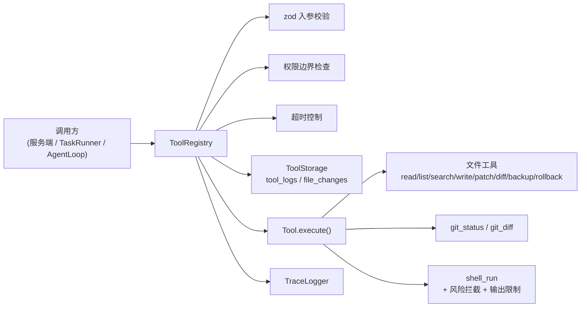

# 工具系统

工具系统是 Agent 与外部世界交互的统一入口：读写文件、搜索、补丁修改、备份回滚、执行命令、查看 git 状态等都以「工具」形式注册，经注册表统一做**入参校验、权限边界、超时控制、备份追踪与审计**。

> 实现依据：本地工具层规范 v1.0（安全、可回滚、可调试）。

## 设计总览



## 工具协议

每个工具实现 `Tool` 接口（`src/tools/types.ts`）：

| 字段 | 说明 |
| --- | --- |
| `name` | 工具名（唯一） |
| `description` | 给人/模型看的说明 |
| `inputSchema` | zod schema，执行前校验入参 |
| `permission` | `read` / `write` / `shell` / `network` / `dangerous` |
| `hasSideEffect` | 是否有副作用（决定是否需要确认） |
| `timeoutMs?` | 可选超时 |
| `execute(input, ctx)` | 实际逻辑；`ctx` 含 `workspaceRoot` / `storage` / `sessionId` |

## 第一阶段内置工具（11 个）

| 工具 | 权限 | 副作用 | 说明 |
| --- | --- | --- | --- |
| `read_file` | read | 否 | 读取文件；默认 200KB 截断；返回 `sha256` |
| `list_files` | read | 否 | 列目录；可递归/限深；默认忽略 `node_modules` 等 |
| `search_text` | read | 否 | 文本搜索；默认 100 条；含上下文行 |
| `write_file` | write | 是 | 整文件写入；确认前返回 `patchPreview`；执行时**默认备份**并返回 `changeId` + `diff` |
| `apply_patch` | write | 是 | **推荐**修改方式：`search/replace` 唯一匹配 |
| `diff_file` | read | 否 | 对比 git / 备份 / 临时内容 |
| `backup_file` | write | 是 | 手动备份到 `agent_data/backups/` |
| `rollback_change` | write | 是 | 按 `changeId` 从备份恢复 |
| `shell_run` | shell | 是 | 执行命令；30s 超时；200KB 输出限制 |
| `git_status` | read | 否 | `git status --short --branch` |
| `git_diff` | read | 否 | `git diff`（可按 path / staged） |

修改已有文件时，Agent **应优先使用 `apply_patch`**，而非直接 `write_file` 整文件覆盖。

## 安全机制

- **路径沙箱**：`resolveInsideWorkspace` / `resolveInsideWorkspaceAsync`（含符号链接校验）。
- **默认忽略目录**：`node_modules`、`.git`、`dist`、`build`、`coverage`、`.cache`、`.lancedb`、`agent_data` 等。
- **输出限制**：read 200KB、search 100 条、list 500 条、shell 输出 200KB。
- **文件变更追踪**（需 `dataDir` 启用 `ToolStorage`）：
  - 每次 write/patch 生成 `changeId`、`beforeHash`、`afterHash`、`diff`、`backupPath`。
  - 备份目录：`agent_data/backups/{date}/{backupId}/`。
  - SQLite：`agent_data/tools.db`（`tool_logs`、`file_changes`、`backups`）。
- **确认前预览**：`POST /api/tools/run` 对 `write_file` / `apply_patch` 未传 `confirm:true` 时先做路径、hash、唯一匹配校验，并返回 `preview.patchPreview`；确认后才真正落盘。
- **命令风险分级**（`checkCommandRisk`）：
  - **high / dangerous（拒绝）**：`rm -rf`、`git reset --hard`、`git clean -fd`、`format` 等。
  - **medium / caution（允许但建议确认）**：`npm install`、`git clean`（非 -f）等。
  - **low / safe**：`node -v`、`git status`、`npm test` 等。
- **权限边界 + 确认门**：与原先一致；`hasSideEffect` 工具需 `confirm:true`，`shell_run` 未确认时会附带命令风险预览。

## 执行结果

`ToolRegistry.run` 返回归一化结果（不抛异常）：

```ts
type ToolRunResult =
  | { ok: true;  tool: string; output: unknown; durationMs: number }
  | { ok: false; tool: string; code: ToolErrorCode; error: string; durationMs: number };
```

## HTTP 接口（测试台）

| 方法 | 路径 | 说明 |
| --- | --- | --- |
| GET | `/api/tools` | 列出已注册工具 |
| POST | `/api/tools/run` | 执行单个工具；副作用工具需 `confirm:true` |

## 自检

```bash
npm run test:tools     # 16 项：沙箱、补丁、回滚、git、shell 风险等
```
