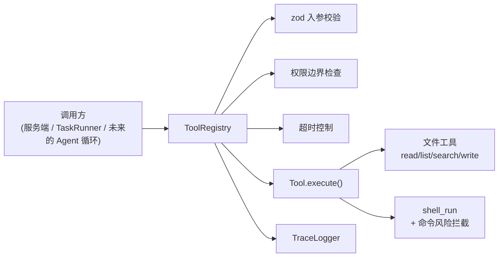
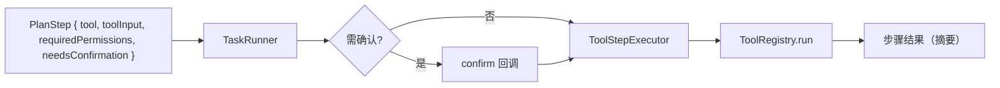

# 工具系统

工具系统是 Agent 与外部世界交互的统一入口：读写文件、搜索、执行命令等都以「工具」形式注册，经注册表统一做**入参校验、权限边界、超时控制与追踪**。它是任务模式真实执行与后续主对话循环的基础。

## 设计总览



## 工具协议

每个工具实现 `Tool` 接口（`src/tools/types.ts`）：

| 字段 | 说明 |
| --- | --- |
| `name` | 工具名（唯一） |
| `description` | 给人/模型看的说明 |
| `inputSchema` | zod schema，执行前校验入参 |
| `permission` | `read` / `write` / `shell` / `network` / `dangerous` |
| `hasSideEffect` | 是否有副作用（决定是否需要确认） |
| `timeoutMs?` | 可选超时 |
| `execute(input, ctx)` | 实际逻辑，`ctx` 含 `workspaceRoot` / `signal` |

## 内置工具

| 工具 | 权限 | 副作用 | 入参 | 说明 |
| --- | --- | --- | --- | --- |
| `read_file` | read | 否 | `path`, `maxBytes?` | 读取工作区内文本文件 |
| `list_files` | read | 否 | `path` | 列出目录条目（不递归） |
| `search_text` | read | 否 | `query`, `dir`, `maxResults` | 纯文本子串搜索，跳过 `node_modules`/`.git` 等与二进制 |
| `write_file` | write | 是 | `path`, `content`, `createDirs` | 写入/覆盖文本文件 |
| `shell_run` | shell | 是 | `command`, `cwd?` | 执行命令，高危拦截、超时 60s |

## 安全机制

- **路径沙箱**：所有文件工具用 `resolveInsideWorkspace` 限定在 `workspaceRoot` 内，越界（如 `../../etc/passwd`）直接报错。
- **命令风险分级**（`checkCommandRisk`）：
  - `dangerous`（直接拦截）：`rm -rf`、`format`、`mkfs`、`dd if=`、关机、fork 炸弹、`git push --force`、`curl … | sh`、`npm publish` 等。
  - `caution`（建议确认）：`rm`/`del`、`git reset --hard`、`git clean`、安装依赖、重定向覆盖等。
  - `safe`：其余。
- **权限边界**：注册表 `run` 接受 `allowedPermissions`，工具权限不在其中则 `permission_denied`。计划模式只给 `read`，任务模式给全集但写/命令类需确认。
- **确认门**：`hasSideEffect` 或属高风险权限的工具，由调用方（服务端 / TaskRunner）在执行前征询确认。

## 执行结果

`ToolRegistry.run` 返回归一化结果（不抛异常）：

```ts
type ToolRunResult =
  | { ok: true;  tool: string; output: unknown; durationMs: number }
  | { ok: false; tool: string; code: ToolErrorCode; error: string; durationMs: number };
// code: unknown_tool | invalid_input | permission_denied | timeout | error
```

## 接入任务模式

`ToolStepExecutor`（`src/agent/ToolStepExecutor.ts`）把计划步骤里绑定的 `tool` + `toolInput` 交给注册表真实执行，未绑定工具的步骤按说明步骤处理。这样任务模式即可从 dry-run 升级为真实执行：



## HTTP 接口（测试台）

| 方法 | 路径 | 说明 |
| --- | --- | --- |
| GET | `/api/tools` | 列出已注册工具及其元信息 |
| POST | `/api/tools/run` | 执行单个工具；副作用工具需 `confirm:true`，否则返回 `needsConfirmation` |
| POST | `/api/task/run` | 用 `ToolStepExecutor` 真实执行一份计划 |
| POST | `/api/task/dry-run` | 仅走状态机、不产生副作用 |

测试台左侧「工具系统」面板可选择工具、填 JSON 入参、执行并查看结果；副作用工具会弹出确认。

## 自检

```bash
npm run test:tools     # 沙箱读写 / 越权拦截 / 风险分级 / 注册表校验（12 项）
```
