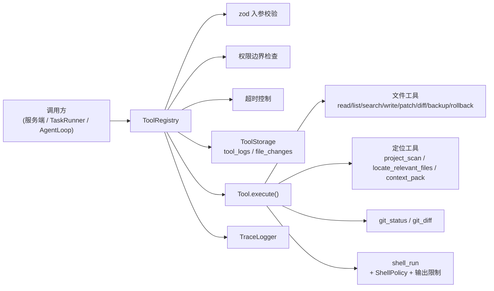

# 工具系统

工具系统是 Agent 与外部世界交互的统一入口：读写文件、搜索、补丁修改、备份回滚、执行命令、查看 git 状态等都以「工具」形式注册，经注册表统一做**入参校验、权限边界、超时控制、备份追踪与审计**。

> 实现依据：本地工具层规范 v1.0（安全、可回滚、可调试）。

## 设计总览



## 工具协议

每个工具实现 `Tool` 接口（`src/tools/types.ts`）：

| 字段 | 说明 |
| --- | --- |
| `name` | 工具名（唯一） |
| `description` | 给人/模型看的说明 |
| `inputSchema` | zod schema，执行前校验入参 |
| `permission` | `read` / `write` / `shell` / `network` / `dangerous` |
| `hasSideEffect` | 是否有副作用（决定是否需要确认） |
| `timeoutMs?` | 可选超时 |
| `execute(input, ctx)` | 实际逻辑；`ctx` 含 `workspaceRoot` / `storage` / `sessionId` |
| `ctx.toolCallId` | 单次工具调用链路 id，贯穿 `agent_tool` / `task_step` / `tool_audit` |

## 内置工具（17 个）

| 工具 | 权限 | 副作用 | 说明 |
| --- | --- | --- | --- |
| `read_file` | read | 否 | 读取文件；默认 200KB 截断；返回 `sha256` |
| `list_files` | read | 否 | 列目录；可递归/限深；默认忽略 `node_modules` 等 |
| `search_text` | read | 否 | 文本搜索；默认 100 条；含上下文行 |
| `write_file` | write | 是 | 整文件写入；确认前返回 `patchPreview`；执行时**默认备份**并返回 `changeId` + `diff` |
| `apply_patch` | write | 是 | **推荐**修改方式：`search/replace` 唯一匹配 |
| `diff_file` | read | 否 | 对比 git / 备份 / 临时内容 |
| `backup_file` | write | 是 | 手动备份到 `agent_data/backups/` |
| `rollback_change` | write | 是 | 按 `changeId` 从备份恢复 |
| `shell_run` | shell | 是 | 执行命令；30s 超时；200KB 输出限制 |
| `git_status` | read | 否 | `git status --short --branch` |
| `git_diff` | read | 否 | `git diff`（可按 path / staged） |
| `project_scan` | read | 否 | 轻量扫描项目结构、配置、源码根和重要文件；写入 ProjectIndex |
| `project_index_update` | read | 否 | 增量刷新 ProjectIndex（paths/forceResync）；符号、import/export、LanceDB 语义向量 |
| `symbol_search` | read | 否 | 按类/函数/类型名查符号定义；优先 ProjectIndex，回退源码扫描 |
| `locate_relevant_files` | read | 否 | 根据任务目标生成 SearchPlan、排序候选文件并返回 primary/candidate；含 `explorationProgress`（duplicate/informationGain）与 `suggestedAction: continue_locating` |
| `context_pack` | read | 否 | 一次读取并摘要多个相关文件，减少连续 `read_file` |
| `dispatch_subagent` | read | 否 | 大任务拆分为 `tasks: DelegatedTask[]` 委派子 Agent（干净上下文、只回收结构化结果）；写操作须 `toolPolicy.writeAllowed` + `grantedPermissions` 含 `write`；深度受 `security.subagent.maxDispatchDepth` 约束 |

修改已有文件时，Agent **应优先使用 `apply_patch`**，而非直接 `write_file` 整文件覆盖。

`write_file` 默认会创建父目录；当模型在新建嵌套路径文件时误传 `createDirs:false`，若目标文件原本不存在且底层写入因 `ENOENT` 失败，工具会自动补建父目录并重试一次。已有文件写入、`createOnly` / `overwrite` / `expectedHash` 冲突、备份恢复和 diff/changeId 记录仍按原规则执行。

查找相关文件时，Agent **应优先使用 `project_scan` → `symbol_search`（已知符号）→ `locate_relevant_files` → `context_pack`**，只有定位结果不足时再回退低层 `list_files` / `search_text` / `read_file`。**写入或批量改动文件后**，可用 **`project_index_update`** 按 `paths` 增量刷新索引，避免重复完整 `project_scan`。

`locate_relevant_files` 在 `needsMoreSearch` 时会返回顶层 `suggestedAction: "continue_locating"`，并在 `explorationProgress` 中记录每步 `duplicate` / `newInformation` / `informationGain`，续跑时通过 `resumeContext.visitedFiles` 跳过重复读内容。预算耗尽时 `executionMeta` 也会回传同名 `suggestedAction`。

`project_scan` 增量写入 ProjectIndex 时会同步解析 **import/export** 到 `project_imports` / `project_exports`，构建模块依赖图；`locate_relevant_files` 会基于依赖图扩展 `dependencyRelated` 邻居文件。文件摘要同时写入 LanceDB（`ProjectSemanticIndexer`），定位时通过 `semanticHits` 语义召回相关源码。

**`HistoryFileRecaller`** 会从会话摘要 `important_files`、项目/任务记忆、历史 `run_states.location`、近期 tool 消息与任务 `requiredContext` 召回文件，经 `locate_relevant_files` 输出 **`historyFileHits`** 并参与排序加权。

## 安全机制

- **路径沙箱**：`resolveInsideWorkspace` / `resolveInsideWorkspaceAsync`（含符号链接校验）。
- **默认忽略目录**：`node_modules`、`.git`、`dist`、`build`、`coverage`、`.cache`、`.lancedb`、`agent_data` 等。
- **输出限制**：read 200KB、search 100 条、list 500 条、context pack 受 `maxFiles` / `maxTokens` 限制、shell 输出 200KB。
- **文件变更追踪**（需 `dataDir` 启用 `ToolStorage`）：
  - 每次 write/patch 生成 `changeId`、`beforeHash`、`afterHash`、`diff`、`backupPath`。
  - 备份目录：`agent_data/backups/{date}/{backupId}/`。
  - SQLite：`agent_data/tools.db`（`tool_logs`、`file_changes`、`backups`）。
- **确认前预览**：`POST /api/tools/run` 对 `write_file` / `apply_patch` / `shell_run` 未传 `confirm:true` 时先做校验或风险评估，并返回 `needsConfirmation` 与预览；确认后才真正执行。
- **命令风险分级**（`checkCommandRisk`）：
  - **high / dangerous（拒绝）**：`rm -rf`、`git reset --hard`、`git clean -fd`、`format` 等。
  - **medium / caution（允许但建议确认）**：`npm install`、`git clean`（非 -f）等。
  - **low / safe**：`node -v`、`git status`、`npm test` 等。
- **命令 allow/deny 策略**：`ShellPolicy` 在内置风险分级之外支持 `security.shell.denyCommands` / `allowCommands` 正则；`shell_run` 与后台任务共用该策略。
- **权限边界 + 确认门**：与原先一致；`hasSideEffect` 工具需 `confirm:true`，`shell_run` 未确认时会附带命令风险预览；`dangerous` 命令确认后仍会被策略拒绝。

## 执行结果

`ToolRegistry.run` 返回归一化结果（不抛异常）：

```ts
type ToolRunResult =
  | { ok: true;  tool: string; output: unknown; durationMs: number; toolCallId?: string }
  | { ok: false; tool: string; code: ToolErrorCode; category: ToolErrorCategory; error: string; durationMs: number; toolCallId?: string };
```

`toolCallId` 是工具调用链路键：AgentLoop 会把同一个 id 写入 `agent_decision` / `agent_tool` / `tool_audit`；TaskRunner 绑定工具步骤会把同一个 id 写入 `task_step` / `tool_audit`。直接通过 `/api/tools/run` 调用时，注册表会自动生成 id。

失败分类 `category` 用于上层恢复策略：

| category | 含义 |
| --- | --- |
| `user_error` | 工具名或入参错误，通常应让模型/用户修正请求 |
| `permission_error` | 权限边界或系统权限不足，需要授权或降级 |
| `environment_error` | 文件/命令/依赖不存在等环境问题 |
| `temporary_error` | 超时、临时网络/进程问题，可考虑重试 |
| `unknown_error` | 未能归类的异常 |

## Mock 工具（测试专用）

`src/tools/mockTools.ts` 提供 `createMockTool` 与 `createMockRegistry`，用于单元测试、集成测试或未来前端回放测试中替换真实工具：

- `createMockTool` 支持 zod 入参校验、权限声明、副作用标记、超时、静态输出、动态输出函数和失败注入。
- 每次执行都会记录到 `mock.calls`，包含入参、`workspaceRoot`、`requestId`、`sessionId`、`taskId`、`toolCallId` 与调用时间；`mock.reset()` 可清空记录。
- `createMockRegistry` 只注册传入的 mock 工具，可设置默认上下文和 trace，便于隔离测试 TaskRunner / AgentLoop 的工具调用链路。
- Mock 工具**不会**进入 `createDefaultRegistry`，生产 `/api/tools` 默认仍只暴露 17 个内置工具。

## HTTP 接口（测试台）

| 方法 | 路径 | 说明 |
| --- | --- | --- |
| GET | `/api/tools` | 列出已注册工具 |
| POST | `/api/tools/run` | 执行单个工具；副作用工具需 `confirm:true` |

## 自检

```bash
npm run test:tools     # 沙箱、补丁、回滚、git、shell 风险/allow-deny、相关文件定位、mock 工具等
```
