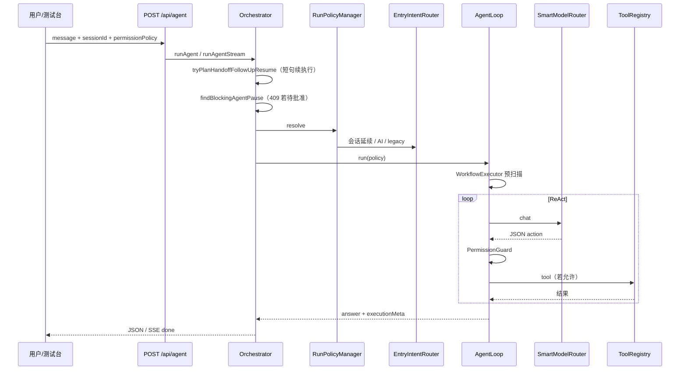
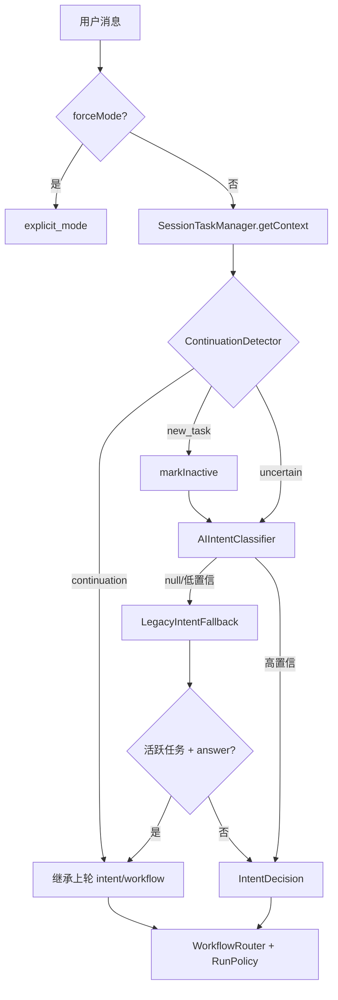
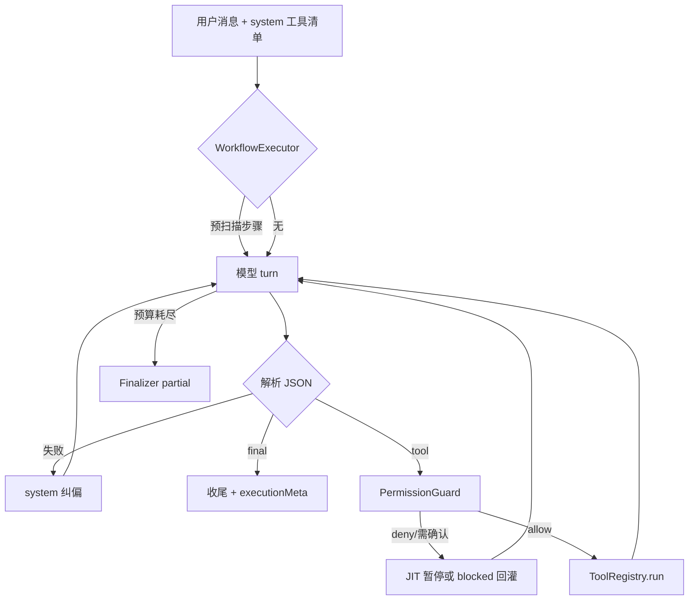
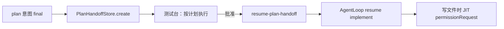
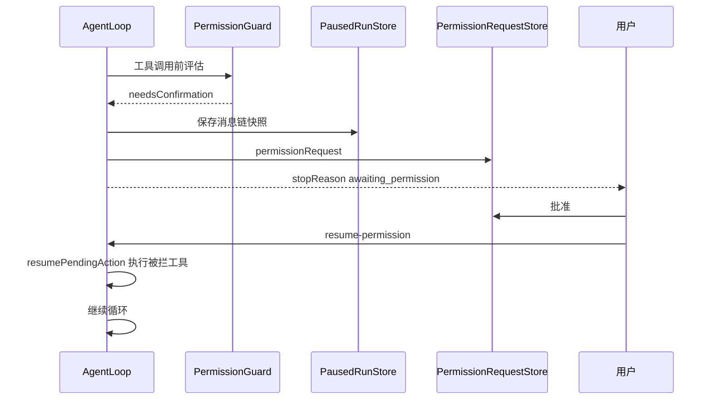

# 执行流程

本文描述用户请求在系统中的端到端路径。配合 [架构设计](架构设计.md) 阅读。

## 1. 统一 Agent 请求（主路径）

### prepareAgentRun 步骤

1. 校验 `message`、`mode`、`permissionPolicy`、`taskType`
2. `RunPolicyManager.resolve` → `EntryIntentRouter`
3. `ensureSession`（持久化会话）
4. `findBlockingAgentPause`：有待处理 planHandoff / permission / paused snapshot → **409**
5. `resolveOrCreateTask`：会话内活动任务
6. 创建 `Run`（`kind: agent`）
7. 构造 `AgentLoop` 并执行

## 2. 入口意图决策

### 延续典型场景

| 场景 | 行为 |
| --- | --- |
| 上轮 edit，粘贴 `#2 read_file [error]` | `session_continuation` → 继续 edit |
| 上轮失败，补充日志 | 延续原 intent |
| 短句「继续改」 | 延续（plan 除外，走 planHandoff） |
| 「换个问题」 | `new_task`，不继承 |
| 活跃任务 + 模糊输入 | 覆盖 legacy `answer`，不掉 chat |

`executionMeta.intentDecisionSource`：`session_continuation` | `ai_classifier` | `legacy_fallback` | `explicit_mode`。

## 3. AgentLoop ReAct 循环

### 消息角色

| role | 来源 |
| --- | --- |
| `user` | 仅真实用户输入 |
| `assistant` | 成功解析的 ReAct 动作 |
| `tool` | 工具结果（发送前经 messageBoundary 渲染） |
| `system` | 工作流切换、handoff、纠偏、通知 |

计划 handoff 后模型先输出普通文本 → 仅内存纠偏 + `parse_error` trace，**不**写入持久化 assistant 历史。

## 4. 计划 → 执行（planHandoff）

- **planHandoff**：「方案是否执行」
- **permissionRequest**：「这个工具调用是否授权」
- 禁止短句从 plan 直接跃迁 execute（须走 handoff 批准）

## 5. JIT 工具权限

`SessionPermissionGrants`：「本次会话都允许」scoped grant。

## 6. 其他续跑路径

| 路径 | 触发 | API |
| --- | --- | --- |
| 预算耗尽 | `RunStateStore` 有 resumable 状态 | `POST /api/agent/resume` |
| 工具权限 | JIT 暂停 | `POST /api/runs/:id/resume-permission` |
| 计划批准 | planHandoff pending | `POST /api/runs/:id/resume-plan-handoff` |
| 已审批计划 | InternalTaskPlan approved | `POST /api/tasks/:id/resume` |

## 7. 流式响应（SSE）

`POST /api/agent/stream` 事件类型：

| 事件 | 内容 |
| --- | --- |
| `activity_event` | 公开执行过程（Timeline） |
| `model_turn` | 思考摘要（非 CoT 落盘） |
| `token` | 可选流式文本 |
| `done` | 完整结果 + `executionMeta` |

取消：`POST /api/runs/cancel`。

## 8. 聊天与计划 API（旁路）

| API | 用途 |
| --- | --- |
| `POST /api/chat` | 单次对话 + Smart 路由 |
| `POST /api/plans/analyze` | 生成 UserVisiblePlan |
| `POST /api/plans/:id/compile` | 编译 InternalTaskPlan |
| `POST /api/plans/:id/execute` | 已审批计划执行 |

这些路径不经 `EntryIntentRouter`，但有各自的 `Planner` / `TaskRunner` 策略。

## 9. UI 状态展示

测试台主标签读取顺序：

1. `executionMeta.userFacingLabel`（优先）
2. `workflowTaskState` / `workflowType` 映射
3. 详情行可展开：`intent`、`executionStage`、`mode（调试）`

计划交接面板 ↔ `planHandoff`；工具权限面板 ↔ `permissionRequest`。**两者不可混用同一弹窗语义。**

## 10. 追踪与复盘

| 产物 | 路径/API |
| --- | --- |
| Trace JSONL | `data/traces/trace.jsonl` |
| 回放 | `GET /api/trace/replay` |
| Run 报告 | `GET /api/runs/:id/report` |
| Activity 文件 | `.agent/runs/{runId}/` |

关键事件：`agent_decision`、`agent_model_turn`、`tool_audit`、`run_usage_summary`。
