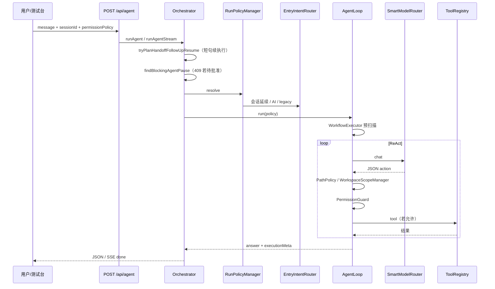
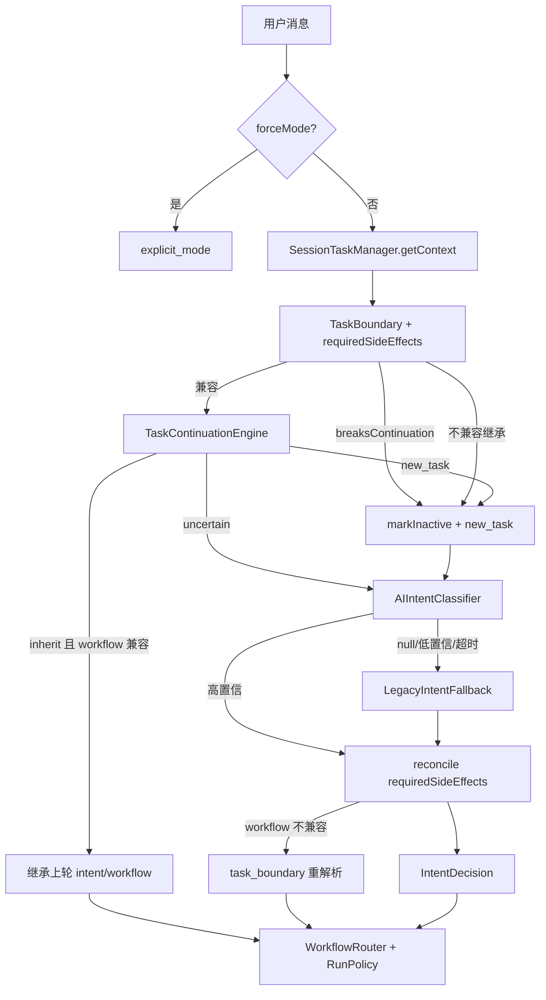
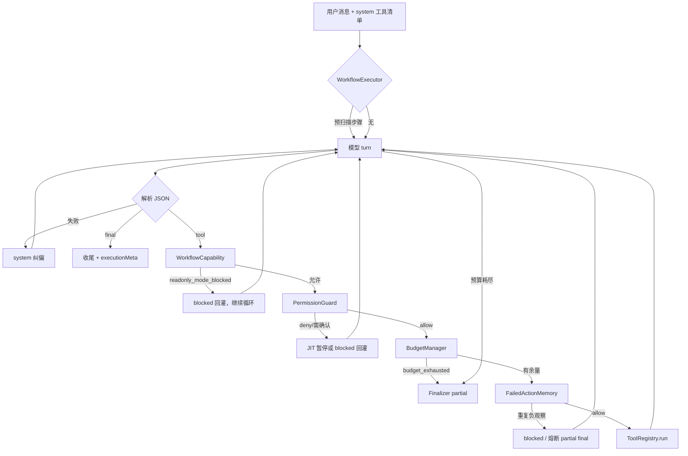
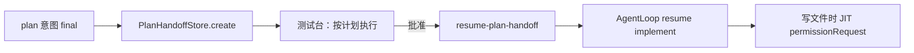
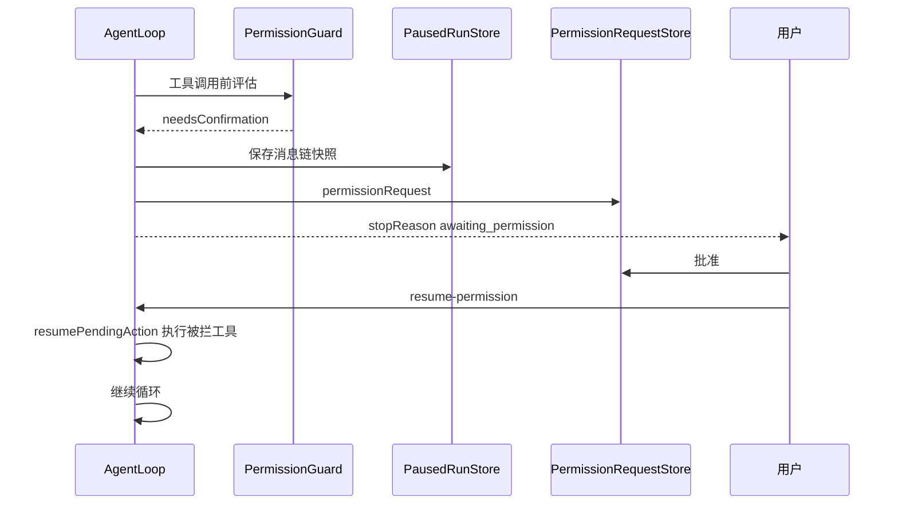
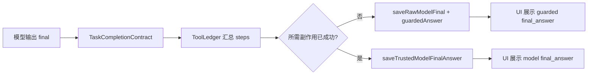

# 执行流程

本文描述用户请求在系统中的端到端路径。配合 [架构设计](架构设计.md) 阅读。

## 1. 统一 Agent 请求（主路径）



### prepareAgentRun 步骤

1. 校验 `message`、`mode`、`permissionPolicy`、`taskType`
2. `RunPolicyManager.resolve` → `EntryIntentRouter`
3. `ensureSession`（持久化会话）
4. `findBlockingAgentPause`：有待处理 planHandoff / permission / paused snapshot → **409**
5. `resolveOrCreateTask`：会话内活动任务
6. 创建 `Run`（`kind: agent`）
7. 构造 `AgentLoop` 并执行

## 2. 入口意图决策

### 多工作区路径授权

路径相关工具在进入真实执行前会先经过 `PathPolicy`：

```text
Tool action
→ PathPolicy.normalize
→ realpath/canonicalize scope root 与目标路径
→ WorkspaceScopeManager.resolveScopeForPath
→ 未授权外部路径：permissionRequest(read_file/write_file/shell)
→ 已授权：以 matchedScope.rootPath 作为工具 workspaceRoot
→ ToolRegistry 内部再次 resolveInsideWorkspace/realpath
→ ToolLedger/Trace/workspace_access_audit 记录事实
```

当前应用层沙箱覆盖 `read_file`、`list_files`、`search_text`、`context_pack`、`project_scan`、`locate_relevant_files`、`symbol_search`、`write_file`、`apply_patch`、`backup_file`、`project_index_update`、`shell_run`、`git_status`、`git_diff` 等路径型工具。外部写入和外部 shell 不会因为路径授权而直接放行，仍必须经过 `PermissionGuard`、`ShellPolicy` 和预算限制；shell scope 只授权 cwd，不授权命令本身。

授权生命周期：

```text
allow_once      → 仅本次 resume 的 scopedGrants
allow_session   → session_permission_grants
allow_project   → workspace_grants(scope=project)
allow_workspace → workspace_grants(scope=workspace)；**shell 类 permission 禁止 allow_workspace**
revoke          → 后续 PathPolicy 重新触发确认，工具缓存不再复用旧 grantVersion
```



### 延续典型场景

| 场景 | 行为 |
| --- | --- |
| 上轮 edit，粘贴 `#2 read_file [error]` | `task_continuation` → 继续 edit |
| 上轮失败，补充日志 | 延续原 intent |
| 短句「继续改」 | 延续（plan 除外，走 planHandoff） |
| 「再好看壮观一点」等视觉/效果续写 | `task_continuation`（弱信号 + 副作用摘要）→ 继承 edit/implement |
| 「换个问题」 | `new_task`，不继承 |
| 上轮 generate_file，「安装依赖」 | `task_boundary` → `runWorkflow`（shell 与 write-only workflow 不兼容） |
| 上轮 run/debug，粘贴 localhost / Vite 日志 | `task_continuation` 或 `ai_classifier` → 继续调试 |

`executionMeta.intentDecisionSource`：`task_continuation` | `task_boundary` | `session_continuation`（legacy 不确定兜底）| `ai_classifier` | `legacy_fallback` | `explicit_mode`。

## 3. AgentLoop ReAct 循环



### 消息角色与 envelope

| 字段 | 作用 |
| --- | --- |
| `role` | 协议来源：`user` / `assistant` / `tool` / `system` |
| `messageKind` | 语义：`user_input` / `tool_action` / `final_answer` / `raw_model_final` / `tool_result` / `workflow_event` |
| `uiVisible` | 是否展示为主聊天气泡 |
| `trusted` | 是否可进入长期上下文 |
| `source` | `user` / `model` / `guard` / `tool` / `workflow` |
| `runId` | 关联 Run |

| role | messageKind | 持久化 | UI 气泡 |
| --- | --- | --- | --- |
| `user` | `user_input` | `saveUserMessage` | ✅ |
| `assistant` | `tool_action` | `saveAssistantToolAction` | ❌（思考过程） |
| `assistant` | `raw_model_final` | `saveRawModelFinal`（仅 trace/debug） | ❌ |
| `assistant` | `final_answer` | `saveTrustedModelFinalAnswer` / `saveGuardedFinalAnswer` | ✅（须 `trusted`） |
| `tool` | `tool_result` | `saveToolMessage` | ❌（Timeline/steps） |
| `system` | `workflow_event` | 默认不写入会话历史 | ❌ |

**Final Guard**：模型 `final` 经 ToolLedger 校验。**仅当模型声称本轮刚完成副作用**（非历史引用）且 Ledger 无记录时，才用 `guardedAnswer`（`source=guard`）替代；**根据历史/先前状态说明**（如「根据历史记录已在之前成功完成」）→ 接受模型 `final_answer`；未虚假声称时保留模型原文，仅以 `executionMeta` 标记 partial。

**禁止**：未通过 Guard 的 raw final 不得作为 UI 主气泡或 trusted 上下文；`workflow_event` 不得伪装 assistant。

### 上下文去污（跨轮可信边界）

当轮 Final Guard 只保证**本轮**回答不误导；**下一轮**模型仍可能从 `ContextRestorer` / 记忆检索 / `context_pack` 读到历史 `raw_model_final` 或未标记 `trusted` 的 assistant 完成声明。去污目标：**只把可验证事实喂给模型**。

| 阶段 | 行为 |
| --- | --- |
| **过滤** | 排除 `raw_model_final`、`tool_action`、`trusted=false` 的 `final_answer`、未验证的 workflow 文本 |
| **降权/升级** | 旧 assistant 默认 `trusted=false`；若消息带 `runId` 则回查 `runs.result_json.executionMeta`（`completionStatus` / `toolLedger`），仅 `completed_success` 可升级为可信 |
| **纠偏** | 对 `misleading_completion` 或无法验证的完成声明，注入 `guard_notice` 纠偏摘要（`systemSections.context_corrections` + `messages` 中 `role=system`） |

**允许进入 context_pack 的消息**：

```text
user_input（trusted=true）
final_answer（trusted=true）
tool_result（trusted=true）
guard_notice（source=guard, trusted=true）
```

**禁止作为事实进入**：

```text
raw_model_final / tool_action
未通过 Guard 的 JSON final
misleading_completion 对应的历史声称
记忆检索中未验证的「已完成/已安装」类声明（trustLevel=unverified 已过滤）
```

实现：`contextTrust.ts`（`shouldIncludeInContext` / `evaluateContextMessageTrust`）、`runFactsLookup.ts`（Run 事实回查）、`ContextRestorer` 过滤+纠偏、`MemoryRetriever` `trustLevel` + `filterTrustedMemories`、`SystemSectionBuilder` 项目记忆去污。恢复 API / 测试台预览暴露 `contextPackage.contextTrust`（`excluded` / `corrections`）。`memory.db` v21 对旧消息回填 `message_kind` / `trusted`。自检：`npm run test:context-trust`、`npm run test:context-decontamination-e2e`。

**工具结果三层语义（toolOutcome）**：

| 类 | 含义 | 示例 |
| --- | --- | --- |
| `execution_error` | 工具未正常执行 | invalid_input、timeout、policy_blocked、tool_crash |
| `observation_failure` | 工具已执行，观察状态不满足 | not_found、no_results、command_failed |
| `observation_success` | 工具已执行且结果符合预期 | 读到文件、搜索命中、exitCode=0 |

`ToolRegistry` 统一解析 `outcomeClass/outcomeKind`；`FailedActionMemory` 记录重复观察失败并熔断；`ToolRecoveryWorkflow` 按 kind 注入恢复路线。Trace/Timeline 区分 `execution_error` 与 `observation_failure`。

**P0 补强（工具结果语义分层后续）**：

| 能力 | 说明 |
| --- | --- |
| `step.ok` 仅兼容 | 新逻辑用 `toolStepOutcome.ts`（`isObservationFailureStep` 等）与 `outcomeClass` |
| 记忆失效 | `write_file` / `apply_patch` / 成功 `read_file` 后 `invalidatePath`，允许修复后验证性重试 |
| `shell_run` 边界 | spawn 失败 → `execution_error`；非零退出码 → `command_failed` |
| Timeline 三态 | `observation_failure` → `warning`（黄），`execution_error` → `failed`（红） |
| 熔断收尾 | `Finalizer.buildRecoveryExhaustedAnswer` 汇总观察失败与建议 |
| 端到端测试 | `npm run test:agent-outcome-e2e`（not_found 去重、修复后重读、command_failed） |

`renderToolOutcome` 回灌模板明确区分「工具已执行但观察不满足」与「工具执行异常」；`list_files` ENOENT / 空目录分别映射 `not_found` / `no_results`。

### 意图路由分层（AI 主判 + 代码裁决）

推荐链路：

```text
MessageSignalExtractor → TaskBoundaryEngine → TaskContinuationEngine
→ AIIntentClassifier / LegacyIntentFallback（语义候选）
→ WorkflowResolver（IntentSemanticAdjudicator + 副作用兼容重解析）
→ WorkflowCapability → PermissionGuard → BudgetManager → FinalGuard
```

| 模块 | 职责 |
| --- | --- |
| `MessageSignalExtractor` | 弱信号：`referencesProjectScope` / `expressesOutcomeDissatisfaction` / `requestsOutcomeChange` 等，**不**直接映射 intent |
| `SideEffectInference` | `inferRequiredSideEffectsFromMessage`：从 goal + 弱信号推断 `read/write/shell` |
| `TaskBoundaryDecision` | 显式操作锚点与活跃 workflow 硬能力是否冲突；shell 需求在 soft write workflow 上仍打断续写 |
| `TaskContinuationEngine` | 会话延续评分；AI 降级 guardrail |
| `AIIntentClassifier` | 异步语义主判（同步路径返回 null） |
| `IntentSemanticAdjudicator` | 代码裁决：只读候选 + 需要 write → `edit`；活跃副作用任务不被只读降级 |
| `WorkflowResolver` | 综合候选 + boundary + 副作用，输出可执行 `intent/workflow`（`intent_adjudicator` / `task_boundary` source） |
| `LegacyIntentFallback` | 关键词兜底，不再单独做主决策 |

典型纠偏：`testTs项目星空有点假，要星云效果` → legacy `answer` → 弱信号推断 `write` → `intent_adjudicator` 纠偏为 `edit/implement/editWorkflow`（`maxModelTurns` 随 implement 提升）。

### 统一工具执行与完成真实性（Phase A/B/C）

| 模块 | 职责 |
| --- | --- |
| `executeToolStep` | 主循环与 JIT resume 共用：escalation → WorkflowCapability → PermissionGuard → Budget → `runToolAction` |
| `EffectiveWorkflowContext` | `entry*` / `reconciled*` / `effective*` 贯通 WriteGate、PermissionGuard、SessionTask |
| `PausedRunSnapshot.runtimeState` | pause 时保存 escalation、预算分项、缓存、FailedActionMemory |
| `CompletionFinalGuard` | 副作用完成以 ToolLedger 为准；历史引用无 ledger → `historical_reference` |
| `RunVerifyWorkflow` | `confirmBeforeRun` / `confirmBeforeEdit` 下 preflight 不自动 `shell_run` |

`budget_exhausted` 在 Timeline 使用 `partialCompleteRun`；UI 气泡仅展示 `trusted=true` 或 `source=guard` 的 final。

### 能力策略与预算边界（WorkflowCapability + CapabilityEscalation + TaskContinuationEngine）

**任务延续**：`MessageSignalExtractor` 仅输出弱信号；`TaskContinuationEngine` 综合 `TaskContext`（含 `lastSideEffectSummary` / `lastStopReason`）评分决定是否继承，**不**将关键词映射为 mode。`EntryIntentRouter` 在 AI 将活跃副作用任务降级为只读 intent 时执行 guardrail。soft workflow（run/edit/debug/verify 等）继承时若消息隐含 write/shell，**不因默认 sideEffectKind 打断续写**——由 `CapabilityEscalation` 在工具调用时 reconcile。

**四层分离**：`WorkflowCapability`（hard 硬阻断 / soft 仅预期）→ `CapabilityEscalation`（soft 超出预期时 reconcile）→ `PermissionGuard` → `BudgetManager` → 工具。

| 层 | 职责 | blockedReasonKind / outcomeKind |
| --- | --- | --- |
| WorkflowCapability | **hard** workflow（answer/plan/review/search/summarize）硬阻断 shell/write；**soft** workflow 不阻断 | `workflow` / `readonly_mode_blocked`（仅 hard） |
| CapabilityEscalation | soft workflow 工具超出默认预期时升级 reconciled workflow，记录到 `executionMeta.capabilityEscalations` | 不阻断；交 PermissionGuard |
| PermissionGuard | 用户是否授权 | `permission` / `permission_denied` |
| BudgetManager | 允许后次数是否用尽 | `budget` / `budget_exhausted` |

**权限解析**：`hardWorkflow` → `allowedPermissions = userPolicy ∩ workflowCapability`；`softWorkflow` → `allowedPermissions = userPolicy`（workflow 默认能力仅作 escalation 依据，不压制用户授权）。

`readonlyOnly` hard 工作流即使用户 `autoRun` 也不得 shell/write。零配额分项**不**再误报 `maxShellCalls` 耗尽。

**Escalation 闭环（P0 补强）**：

| 模块 | escalation 后行为 |
| --- | --- |
| `SessionTaskManager` | `intent`/`workflowType` 写入 **reconciled** 值；保留 `entryIntent`/`entryWorkflowType` 供 debug |
| `TaskContinuationEngine` | 续写继承 reconciled workflow，不再落回 `runWorkflow` |
| `AgentLoop` system prompt | soft workflow 提示可动态升级；已升级时注入 reconciled 状态 |
| `CompletionFinalGuard` | contract 合并 `capabilityEscalations.targetSideEffects` |
| `BudgetManager` | 若升级需要 write/shell 而分项预算为 0，抬升到建议预算下限 |
| Activity Timeline | `escalation` 步骤展示升级原因与权限策略 |

**权限策略命名**：`autoRun` = 自动允许 **写文件 + 执行命令**（非仅 shell）；测试台选项已标注「写文件+命令」。`autoEdit` 仅写文件。

**P1 补强**：

| 能力 | 说明 |
| --- | --- |
| 更多工具 outcome | `locate_relevant_files` / `symbol_search` / `write_file` / `apply_patch` / `project_scan` 经 `resolveToolOutcome` 归一化 |
| **运行预算分层** | `RunBudget` 增加 `maxPreflightTools` / `maxRecoveryTurns` / `maxRepeatedToolFailures`；预扫描、系统恢复、主 model turn 分层计数 |
| **Run 内只读缓存** | `RunToolResultCache`：`read_file` / `list_files` / `project_scan` 等同 input 复用，不重复消耗 readCalls |
| **系统工具恢复** | `SystemToolRecovery`：`project_scan` 等失败后自动 `list_files` fallback，不消耗主 model turn |
| **失败熔断前置** | `FailedActionMemory`：相同 tool+input 第 2 次直接拦截；`maxRepeatedToolFailures` 默认 1 |
| **预算耗尽 partial** | `Finalizer` 输出已完成/未完成/原因/建议结构 |
| Workflow 迁移 | `WorkflowStateCenter` / `WorkflowWriteGate` / 写入跟进工作流改用 `toolStepOutcome.isSuccessfulToolStep` |
| Trace 统计 | `RunUsageReport` 增加 `toolObservationFailures` / `toolExecutionErrors`；`tool_audit` 时间线展示 outcome |
| E2E 补全 | `test:agent-outcome-e2e` 覆盖 search `no_results`、`command_not_found` |
| Windows 命令未找到 | GBK 乱码 stderr 时用「exitCode=1 + 引号命令名」启发式识别 `command_not_found` |

**P2 补强**：

| 能力 | 说明 |
| --- | --- |
| 计划/验证上下文 | `PlanWorkflow` / `RunVerifyWorkflow` 用 `toolStepPayloadForContext` 回灌 outcome |
| `context_pack` outcome | 全部跳过 → `no_results`；部分成功 → `observation_success` |
| `RunBudgetUsage` | `executionMeta.usage` 含 `toolObservationFailures` / `toolExecutionErrors` |
| `run_usage_summary` | trace 写入三类 outcome 计数 |
| 测试台 Run 报告 | 用量行展示「观察失败 / 执行错误」分项；时间线 pill 黄/红区分 |

## 4. 计划 → 执行（planHandoff）



- **planHandoff**：「方案是否执行」
- **permissionRequest**：「这个工具调用是否授权」
- 禁止短句从 plan 直接跃迁 execute（须走 handoff 批准）

## 5. JIT 工具权限



`SessionPermissionGrants`：「本次会话都允许」scoped grant。

### 5.2 副作用任务 Final Guard（P0）

副作用任务（安装依赖、写文件等）的完成状态**不能只看模型是否输出 `final`**，必须在 `finishRun` 前经 **CompletionFinalGuard** 校验：



| 模块 | 路径 | 职责 |
| --- | --- | --- |
| TaskCompletionContract | `completion/TaskCompletionContract.ts` | 从 goal + intent 推断所需 read/write/shell |
| ToolLedger | `completion/ToolLedger.ts` | 从 `AgentToolStep[]` 统计 attempted/blocked/successful |
| CompletionFinalGuard | `completion/CompletionFinalGuard.ts` | 校验 accepted；拒绝时 `guardedAnswer`（`source=guard`） |

**envelope 边界**：`raw_model_final` 仅 trace/debug；`final_answer` + `trusted=true` 才可进 UI 气泡与长期上下文；Guard 后回答显式标注 `source=guard`（UI 元信息「系统核实」），不伪装模型原话。

**runWorkflow shell JIT**：`confirmBeforeEdit` / `autoEdit` 下 workflow 需要 shell 时，`resolveAllowedPermissions` 将 shell 纳入能力上限 → `PermissionGuard` 走 `needsConfirmation` → JIT 暂停。

**回灌文案**：`renderBlockedRecoveryMessage` 对副作用工具禁止「直接输出 final 声称成功」。

**UI**：`resolveRunUiStatus` 基于 `completionStatus` / `stopReason`，`partial` / `awaiting_permission` 不显示「已完成」。

## 6. 其他续跑路径

| 路径 | 触发 | API | permissionPolicy |
| --- | --- | --- | --- |
| 预算耗尽 | `RunStateStore` 有 resumable 状态 | `POST /api/agent/resume` | 仅用 `RunState.permissionPolicy`，忽略 body |
| 工具权限 | JIT 暂停 | `POST /api/runs/:id/resume-permission` | 仅用 `PausedRunSnapshot`，忽略 body |
| 计划批准 | planHandoff pending | `POST /api/runs/:id/resume-plan-handoff` | 仅用快照；`allow_session` 仅影响 handoff→implement 的 autoEdit 推导 |
| 已审批计划 | InternalTaskPlan approved | `POST /api/tasks/:id/resume` | 任务层策略 |

测试台续跑请求**不得**附带当前下拉框 `permissionPolicy`，避免批准后用更宽松策略续跑。

## 7. 流式响应（SSE）

`POST /api/agent/stream` 事件类型：

| 事件 | 内容 |
| --- | --- |
| `activity_event` | 公开执行过程（Timeline） |
| `model_turn` | 思考摘要（非 CoT 落盘） |
| `token` | 可选流式文本 |
| `done` | 完整结果 + `executionMeta` |

取消：`POST /api/runs/cancel`。

## 8. 聊天与计划 API（旁路）

| API | 用途 |
| --- | --- |
| `POST /api/chat` | 单次对话 + Smart 路由（可选 `parallel_vote` 多模型投票，仅本路径） |
| `POST /api/plans/analyze` | 生成 UserVisiblePlan |
| `POST /api/plans/:id/compile` | 编译 InternalTaskPlan |
| `POST /api/plans/:id/execute` | 已审批计划执行 |

这些路径不经 `EntryIntentRouter`，但有各自的 `Planner` / `TaskRunner` 策略。

> **parallel_vote 边界**：`parallel_vote` 协作模式仅由 `POST /api/chat`（及 `/api/chat/stream`）经 `ModelOrchestrator` 触发；`POST /api/agent` 主循环始终走单模型 Smart 路由，不支持并行投票。

## 9. UI 状态展示

测试台主标签读取顺序：

1. `executionMeta.userFacingLabel`（优先）
2. 等待操作 / 权限策略摘要
3. 详情行（仅 `?dev=1`）：`intent`、`executionStage`、`mode`、`intentDecisionSource`

计划交接面板 ↔ `planHandoff`；工具权限面板 ↔ `permissionRequest`。**两者不可混用同一弹窗语义。**

## 10. 追踪与复盘

| 产物 | 路径/API |
| --- | --- |
| Trace JSONL | `data/traces/trace.jsonl` |
| 回放 | `GET /api/trace/replay` |
| Run 报告 | `GET /api/runs/:id/report` |
| Activity 文件 | `.agent/runs/{runId}/` |

关键事件：`agent_decision`、`agent_model_turn`、`tool_audit`、`run_usage_summary`。
