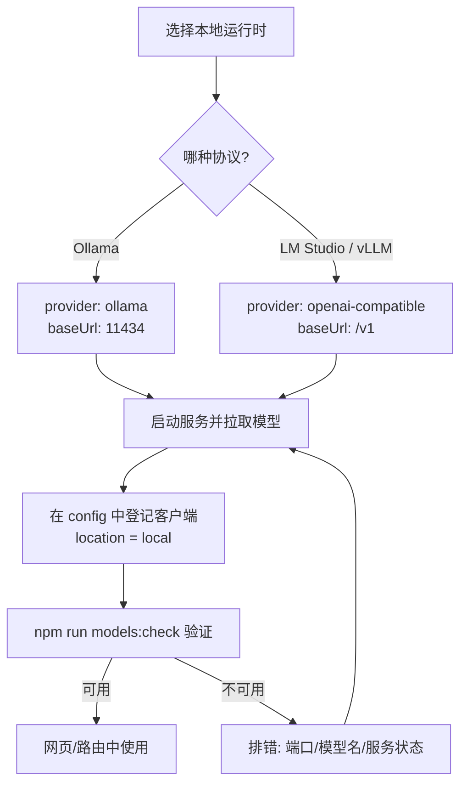
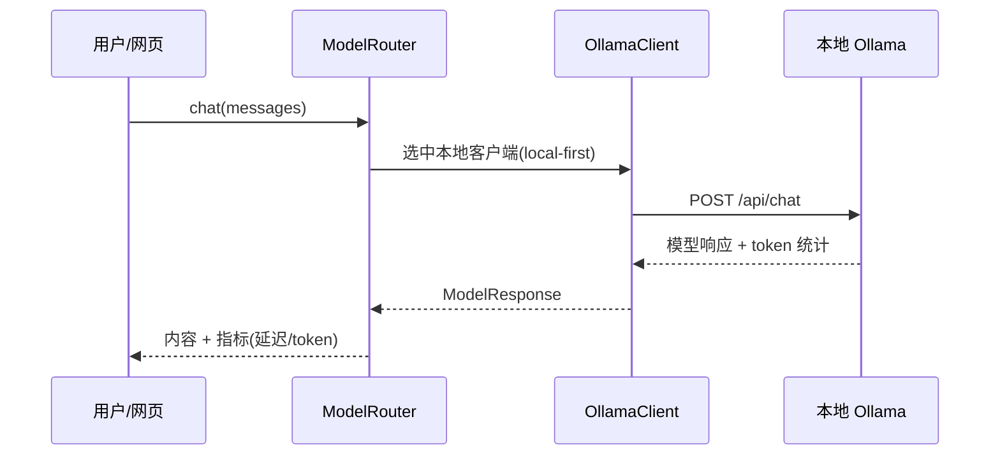

# 接入本地模型

本文说明如何在本项目中接入并使用本地模型，包含**流程、配置、使用、排错**四部分。

适用版本：**AgentRelay**（npm 包 `agent-relay`，TypeScript / Node.js）。所有命令默认在 `agent-relay/` 目录下执行；默认端口 **18787**。

---

## 1. 概述

项目通过统一的 `ModelClient` 接口接入模型，本地与远程模型共用同一套调用方式。程序**不会自动识别 API 格式**，而是根据配置中的 `provider` 字段显式选择客户端实现：

| `provider` | 客户端 | 协议 | 典型本地运行时 |
|---|---|---|---|
| `ollama` | `OllamaClient` | Ollama 原生 `/api/chat` | Ollama |
| `openai-compatible` | `OpenAICompatibleClient` | OpenAI `/v1/chat/completions` | LM Studio、vLLM、llama.cpp server 等 |

接入本地模型 = 在配置文件里增加/修改一条 `location: "local"` 的客户端记录，并保证本地服务在运行。

**探测已安装模型（不自动改配置）**：`GET /api/models/catalog` 会对配置里所有 `location: "local"` 的客户端探测端点——Ollama 读 `/api/tags`，OpenAI-compatible 读 `/v1/models`——返回 `entries[].models` 与 `configuredModelInstalled`。路由仍只使用 `config` 里登记的客户端，目录 API 用于对照模型名与排错。

### 接入流程总览



### 请求调用链路



---

## 2. 前置条件

- 已安装依赖：在 `agent-relay/` 执行过 `npm install`。
- 本地已安装并运行某个模型运行时（Ollama 或 LM Studio / vLLM）。
- 配置文件位于 `agent-relay/config/`，按 profile 区分：`default.json` / `local-only.json` / `cloud.json`。

---

## 3. 方式一：Ollama（推荐，开箱即用）

`default.json` 中已内置 `local-qwen35` 指向本地 Ollama 的 `qwen3.5:0.8b`，通常无需改配置。

### 3.1 流程

1. 安装 Ollama：到 [ollama.com](https://ollama.com) 下载安装，或 `winget install Ollama.Ollama`（安装后一般会自动后台运行）。
2. **（可选）模型存放到其他盘**：设置用户环境变量 `OLLAMA_MODELS=E:\Ollama\models`（或联接 `C:\Users\<你>\.ollama\models` → 目标目录），然后**完全退出托盘 Ollama 再重新打开**，再拉取模型。本机示例：`phi4` 约 9.1GB 落在 `E:\Ollama\models`。
3. 确认服务在运行（默认端口 `11434`）。如未运行，手动启动：

   ```bash
   ollama serve
   ```

4. 拉取模型（名称需与配置中的 `model` 一致）：

   ```bash
   ollama pull qwen3.5:0.8b
   ollama pull phi4          # 可选：本地强模型（约 9.1GB，已登记为 local-phi4）
   ollama pull qwen2.5vl:7b # 可选：本地视觉模型（已登记为 local-qwen25vl）
   ollama run qwen3.5:0.8b   # 可选：进入交互测试
   ```

5. 验证接入：

   ```bash
   npm run models:check
   ```

   `local-qwen35`、`local-phi4`、`local-qwen25vl` 显示「可用」即成功。也可在测试台网页点「检测模型可用性」。

### 3.2 对应配置

```json
{
  "name": "local-qwen35",
  "provider": "ollama",
  "location": "local",
  "baseUrl": "http://localhost:11434",
  "model": "qwen3.5:0.8b",
  "think": false
}
```

字段说明：

- `name`：客户端唯一名称（网页下拉框、统计、路由都用它）。
- `provider`：必须为 `ollama`。
- `location`：必须为 `local`（路由与「仅本地」判断依赖它）。
- `baseUrl`：Ollama 服务地址，默认 `http://localhost:11434`（注意：Ollama 原生端点不带 `/v1`）。
- `model`：Ollama 中的模型标签，需与 `ollama pull` 的名称一致。
- `think`：Ollama thinking 开关。默认建议 `false`，保证 `message.content` 有最终回答；需要启用 thinking 时改为 `true`，重启 `npm run serve` 后生效。

**强本地模型 `local-phi4`（`default.json` 已内置）**：

```json
{
  "name": "local-phi4",
  "provider": "ollama",
  "location": "local",
  "baseUrl": "http://localhost:11434",
  "model": "phi4",
  "think": false,
  "routerProfile": {
    "defaultLevel": 3,
    "relativeCost": "free",
    "canDraft": true,
    "canReview": true,
    "canFinal": true,
    "allowedRoles": ["primary", "draft", "review", "final"]
  }
}
```

默认仍使用轻量 `local-qwen35`；架构/复杂任务经 Smart 路由可升到 `local-phi4`（Level 3）。显式指定时在请求里传 `clientName: "local-phi4"`。

**本地视觉模型 `local-qwen25vl`（`default.json` 已内置）**：

```json
{
  "name": "local-qwen25vl",
  "provider": "ollama",
  "location": "local",
  "baseUrl": "http://localhost:11434",
  "model": "qwen2.5vl:7b",
  "think": false,
  "routerProfile": {
    "displayName": "Qwen2.5-VL 7B",
    "defaultLevel": 3,
    "relativeCost": "free",
    "supportsVision": true,
    "canDraft": true,
    "canReview": true,
    "allowedRoles": ["primary", "draft", "review"]
  }
}
```

含图片附件时 Smart 路由会优先选择带 `supportsVision` 的模型；本地 profile 下可落到 `local-qwen25vl`。显式指定：`clientName: "local-qwen25vl"`。

### 3.3 Thinking 模型与空响应

Qwen3/Qwen3.5、DeepSeek-R1 等 Ollama thinking 模型可能把输出写入 `message.thinking`，而 `message.content` 为空；此时前端会显示「(空响应)」，同时 token 输出数很高。AgentRelay 的 `OllamaClient` 会按配置在 `/api/chat` 请求顶层传 `think`，默认配置为 `false`，让 Ollama 直接返回最终内容，避免本地模型把预算耗尽在 thinking 字段。

如果你希望启用 thinking，可把对应 Ollama 客户端改为：

```json
"think": true
```

注意：当前统一 `ModelResponse` 只展示最终 `content`，暂未在测试台单独展示 `message.thinking`；开启 thinking 后应适当增大输出上限或选择更强模型，避免最终内容为空。

### 3.4 更换模型

```bash
ollama pull llama3.1:8b
```

然后把配置里的 `model` 改成 `llama3.1:8b`，重启服务即可。

---

## 4. 方式二：LM Studio / vLLM（OpenAI 兼容）

适用于提供 OpenAI 兼容端点的本地运行时。`default.json` 中已有占位条目 `local-lmstudio`。

### 4.1 流程（以 LM Studio 为例）

1. 在 LM Studio 下载一个模型。
2. 打开 **Developer → Local Server**，点击 Start，记下：
   - 服务地址（默认 `http://localhost:1234/v1`）。
   - 模型标识符（界面会显示）。
3. 修改配置中的 `baseUrl` 与 `model` 为实际值。
4. `npm run models:check` 验证。

vLLM 类似：启动 `vllm serve <模型>`（默认 `http://localhost:8000/v1`），把 `baseUrl` / `model` 填对即可。

### 4.2 对应配置

```json
{
  "name": "local-lmstudio",
  "provider": "openai-compatible",
  "location": "local",
  "baseUrl": "http://localhost:1234/v1",
  "apiKey": "lm-studio",
  "model": "local-model"
}
```

注意：

- `provider` 为 `openai-compatible`。
- `baseUrl` 通常以 `/v1` 结尾。
- `apiKey`：本地服务一般不校验，但 SDK 要求非空，填任意占位字符串即可（如 `lm-studio`）。
- `model`：填本地服务实际暴露的模型名。

---

## 5. 新增一个本地模型客户端

直接在目标 profile 的 `models.clients` 数组里追加一条，`location` 设为 `"local"`：

```json
{
  "name": "local-llama",
  "provider": "ollama",
  "location": "local",
  "baseUrl": "http://localhost:11434",
  "model": "llama3.1:8b"
}
```

配置由 `src/config/types.ts` 的 zod schema 校验，字段缺失或取值非法会在启动时报错。

---

## 6. 使用

### 6.1 路由自动优先本地

默认策略 `local-first`（见 `config/*.json` 的 `routing.strategy`），「自动（默认）」会优先选择可用的本地模型；远程失败时按 `fallback` 降级。

- 切换为「仅本地」策略：把 `routing.strategy` 设为 `privacy-first`，或直接用 `local-only` profile。
- 单次请求强制仅本地：测试台网页勾选「敏感（仅本地）」。
- 按任务类型微调（`POST /api/chat`、`POST /api/agent` 可选 `taskType`）：
  - `simple`：在策略排序之上**再优先本地**（适合寒暄、短问答）。
  - `reasoning` / `codegen` / `long_context`：**优先远程强模型**（计划模式默认 `reasoning`）。

### 6.2 网页使用

```bash
npm run serve
```

打开 http://localhost:18787，在底部「模型」下拉框选择本地模型（如 `local-qwen35（local / qwen3.5:0.8b）`），或保持「自动（默认）」由路由选择。

> 下拉框只列出**检测后确实可用**的模型；本地服务没启动时不会出现。

**测试台主界面：**


**点击「检测模型可用性」可查看本地/远程模型状态：**


### 6.3 命令行验证

```bash
npm run models:check            # 仅检测可用性
npm run models:check -- --chat  # 对默认可用模型发一条测试消息
curl http://localhost:18787/api/models/catalog  # 列出本地端点已安装模型
```

---

## 7. 重要提示

- **改完配置需重启服务**：配置在启动时加载一次，修改 `config/*.json` 后要重启 `npm run serve` 才生效。
- **切换 profile**：设置环境变量 `AGENT_PROFILE=local-only`（可选 `default` / `local-only` / `cloud`）。
- **`location` 必须准确**：本地模型务必为 `"local"`，否则路由与「仅本地」约束会失效。

---

## 8. 排错

| 现象 | 可能原因 | 处理 |
|---|---|---|
| `models:check` 显示本地模型「不可用」 | 服务未启动 / 端口不对 | 启动 Ollama 或 LM Studio，核对 `baseUrl` 端口 |
| 对话报 `fetch failed` | 选了未运行的本地模型 | 启动对应服务，或改选其它可用模型 |
| Ollama 可用但对话报模型不存在 | 未 `ollama pull` 或 `model` 名不符 | 拉取模型并保证名称与配置一致 |
| LM Studio 报鉴权/连接错误 | `baseUrl` 未含 `/v1` 或端口错误 | 修正 `baseUrl`，`apiKey` 填非空占位 |
| 启动即报配置校验失败 | 字段缺失或 `provider` 非法 | 按 `src/config/types.ts` 的 schema 修正 |
