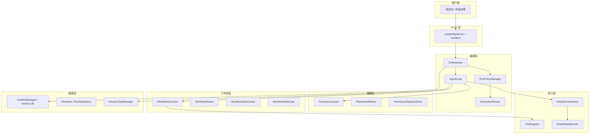

# 架构设计

> AgentRelay 本地优先 Agent 编排后端 — 当前架构快照（2026-06）

## 1. 设计目标

| 目标 | 说明 |
| --- | --- |
| 单一 Agent 入口 | 用户只表达任务；不强制理解 chat/plan/implement 等 mode |
| 会话连续性 | 同一会话默认延续任务上下文，除非明确换话题 |
| AI 理解 + 规则护栏 | 意图可 AI 判断；写/删/跑命令由 `PermissionGuard` 硬控制 |
| 本地优先 | 本地模型、SQLite、LanceDB；敏感数据可 `privacy-first` |
| 可观测 | 统一 Run、Trace、Activity Timeline、`executionMeta` |

## 2. 总体分层



### 分层职责

| 层 | 目录 | 职责 |
| --- | --- | --- |
| 应用装配 | `app/` | `AppContext`、依赖注入、启动恢复 |
| 编排 | `orchestrator/` | 统一 Run/Task、HTTP 门面、`prepareAgentRun` |
| Agent 核心 | `agent/` | ReAct 循环、预算、工作流阶段、入口路由 |
| 计划 | `plan/` | 三类计划、编译、审批、`TaskRunner` |
| 策略 | `policy/` | 权限、风险、planHandoff、JIT 权限存储 |
| 模型 | `model/` | Provider 适配、`messageBoundary` |
| 模型路由 | `model-router/` | Smart 路由、规则、fallback、评测 |
| 模型编排 | `model-orchestrator/` | 单模型 / 草拟+审查执行 |
| 工具 | `tools/` | 注册、沙箱、审计、备份 |
| 上下文 | `context/` | 会话、记忆、项目索引、向量 |
| 追踪 | `trace/`、`agent/timeline/` | JSONL 审计、公开 Activity |
| 生命周期 | `lifecycle/` | 用量统计、清理 |

**边界规则**：`model/` 不引用 agent/plan/tools；工具副作用声明须诚实；知识层避免反向依赖执行层格式化逻辑。

## 3. 入口意图架构（架构纠偏后）

旧路径（已降级）：

```text
关键词 / IntentRouter → mode → workflow
```

当前主路径：

```text
SessionTaskManager（TaskContext）
  → ContinuationDetector（延续 / 新任务）
  → AIIntentClassifier（P2 占位，双轨待接）
  → LegacyIntentFallback（`IntentRouter` 类，**仅测试/兜底**；生产主路径为 `EntryIntentRouter`）
  → WorkflowRouter
```

| 组件 | 路径 | 作用 |
| --- | --- | --- |
| `TaskContext` | `agent/task/TaskContext.ts` | 会话内连续任务：intent、phase、失败摘要 |
| `SessionTaskManager` | `agent/task/SessionTaskManager.ts` | SQLite `session_task_contexts`（v17）+ 内存 |
| `ContinuationDetector` | `agent/routing/ContinuationDetector.ts` | 失败粘贴、短句续写、换话题 |
| `EntryIntentRouter` | `agent/routing/EntryIntentRouter.ts` | 主入口路由 |
| `LegacyIntentFallback` | `agent/routing/LegacyIntentFallback.ts` | 关键词兜底 |
| `RunPolicyManager` | `agent/RunPolicyManager.ts` | 预算、permissionPolicy、allowedPermissions |

**用户可见状态**由 `ExecutionStatePresenter` 产出 `userFacingLabel`（如「正在修改文件」「等待你批准执行」），`mode` 仅审计/调试。

### 词汇收敛（P5）

| 层 | 类型 | 用途 | 对外暴露 |
| --- | --- | --- | --- |
| 入口 | `AgentIntentType` | 用户任务语义 | `executionMeta.intent`（非 dev 可隐藏） |
| 工作流 | `AgentWorkflowType` | 预扫描与写入门控 | `executionMeta.workflowType` |
| 运行态 | `AgentRunMode` | 预算/系统提示 | 仅 `?dev=1` 或内部 |
| 阶段 | `AgentExecutionStage` | analyze/plan/execute/verify | `executionMeta.executionStage` |
| TaskRunner | `TaskRunnerPermissionMode` | 计划步骤权限（原 `AgentMode` plan/task） | 仅任务层 |

映射单一来源：`agent/intentPatterns.ts`。新代码优先 `intent` + `workflowType`，避免再引入第四套 mode 词汇。

## 4. Agent 执行核心

### AgentLoop（ReAct JSON）

模型每轮输出一个 JSON 动作（非原生 function-calling，便于本地/远程统一）：

- `{"action":"tool","tool":"...","input":{...}}`
- `{"action":"final","answer":"..."}`

循环内：`PermissionGuard` → `ToolRegistry` → 结果回灌；预算分项限制（model/tool/read/write/shell/runtime）。

### 工作流（内部编排）

`WorkflowRouter` 将 `intent` 映射到 `workflowType`（用户不直接感知）：

| workflowType | 典型意图 | 要点 |
| --- | --- | --- |
| `answerWorkflow` | answer | 工具层强制只读 |
| `planWorkflow` | plan | 只读预扫描 + 计划输出 |
| `editWorkflow` | edit | 预定位 → proposal → 写入门控 → 验证 |
| `debugWorkflow` | debug | debug_locate → 分析 phase → 修复 |
| `verifyWorkflow` | verify/run | 白名单安全命令或静态降级 |

`WorkflowStateCenter` + `WorkflowWriteGate`：写入前须有 proposal/analysis；验证通过前禁止连续写；修正上限后 `terminated`。

### 预算与收尾

- `BudgetManager`：分项硬限制 + 建议预算
- `Finalizer`：预算耗尽时 partial final + `executionMeta`
- `RunStateStore`：预算耗尽可 `POST /api/agent/resume` 续跑

## 5. 计划体系

三类计划（勿混用）：

| 类型 | 存储 | 可执行 | 用途 |
| --- | --- | --- | --- |
| `UserVisiblePlan` | `user_visible_plans` | 否 | 给人看的 Markdown/Todo |
| `InternalTaskPlan` | 内部表 | 是（需审批） | 机器可执行步骤 |
| `AgentStepPlan` | 瞬态 trace | 否 | 循环内步骤摘要 |

**循环内 plan 结束** → `PlanHandoffStore`（计划→执行批准，与工具权限分离）。

**结构化 API**：`/api/plans/analyze` → compile → approve → execute（`TaskExecutionWorkflow`）。

## 6. 权限与安全

### 双通道确认

| 机制 | 时机 | 存储 |
| --- | --- | --- |
| `planHandoff` | 计划完成，是否按方案执行 | `plan_handoffs` |
| `permissionRequest` | 模型真要调用副作用工具时 JIT 暂停 | `permission_requests` + `paused_run_snapshots` |

`PermissionGuard` 决策：`allow` / `needsConfirmation` / `deny`。即使用户 `autoEdit`/`autoRun`，删除/推送/装依赖等仍强制确认。

**续跑与 grant（2026-06 补强）**：

| 规则 | 说明 |
| --- | --- |
| 续跑策略冻结 | JIT / planHandoff / 预算续跑均**忽略**客户端 body 的 `permissionPolicy`，仅以快照或 `RunState` 为准 |
| forced 优先 | `resolveForcedConfirmation` 先于 scoped grant；已批准 grant **不得**绕过 git push / 敏感文件等强制确认 |
| shell grant 精确匹配 | `scopedPermissionCheck` 命令须规范化后**完全相等**，禁止前缀扩展 |
| shell 长期授权 | `allow_workspace` **禁止**用于 shell 类 `permissionRequest`（API 400） |
| 手动工具 | `POST /api/tools/run` 的 `confirm: true` 仍走完整 `PermissionGuard`（一次性 scoped grant） |

### 其他

- `ShellPolicy` / `NetworkPolicy` / 路径沙箱
- `util/redact` 日志脱敏；远程调用前脱敏提示
- 消息角色：`user` 仅真实用户；工具结果 `tool`；运行态上下文 `system`

## 7. 模型路由（双轨）

| 轨道 | 模块 | 何时 |
| --- | --- | --- |
| **任务层 Smart** | `SmartModelRouter` | `/api/chat`、Agent、Planner、子 Agent 默认 |
| **显式客户端** | `ModelRouter` | 请求指定 `clientName` |

Smart 路径：`ContextAnalyzer` → `RuleRouter` → `DecisionEngine`（能力矩阵、运行时统计、成本）→ `ModelOrchestrator`。

协作模式：`single_model` | `local_draft_remote_review` | `parallel_vote`（**仅** `/api/chat` 与 `/api/chat/stream`；Agent 主循环强制单模型）| `rule_only`（短问候）。

**V9 可视化**：`GET /api/routing/logs?routeLogId=…` 返回 `pipelineGraph`（节点/边 + Mermaid 文本）；测试台「模型路由日志」详情区渲染管线图。

**并行投票**：`qualityMode=deep` 且任务走协作路径时，若存在 ≥2 个 primary 候选与 review 裁决模型，则 `DecisionEngine` 选 `parallel_vote`；`ModelOrchestrator` 并行生成后由裁决模型 JSON 选 winner（失败时启发式最长答案）。

## 8. 统一 Run 模型

`RunStore` 记录所有运行：`kind` = agent | task | subagent | chat | …

| 字段/概念 | 说明 |
| --- | --- |
| `sessionId` | 会话；绑定 `ContextManager` 消息 |
| `taskId` | 会话内活动任务 |
| `executionMeta` | 模式、意图、工作流、预算、userFacingLabel |
| `stopReason` | completed / awaiting_permission / awaiting_plan_handoff / … |

启动恢复：`startupRecovery.ts` 将带暂停快照的 running Run 恢复为 `waiting_confirmation` 或 `waiting_plan_handoff`。

## 9. 数据存储

| 存储 | 版本 | 内容 |
| --- | --- | --- |
| `memory.db` | v17 | 会话、记忆、计划、路由日志、权限暂停、session_task_contexts |
| `tools.db` | v1 | 工具备份、changeId、tool_logs |
| `data/traces/*.jsonl` | — | 审计事件 |
| `.agent/runs/{id}/` | — | Activity Timeline 文件 |
| LanceDB | — | 向量检索（可选） |

迁移：`src/context/memoryDbMigrations.ts`、`src/storage/sqliteMigration.ts`。

## 10. 子 Agent

- 工具：`dispatch_subagent`，参数 `tasks: DelegatedTask[]`
- 执行：`SubAgentCoordinator` + `ExecutionRouter`
- 路由：`createDelegatedTaskChatFn` → SmartModelRouter
- 深度：`security.subagent.maxDispatchDepth`（默认 1）

## 11. 多工作区授权沙箱

当前沙箱仍是应用层安全边界，不是 Docker/VM/AppContainer 等系统级隔离。系统在保留单工具 `pathSafe` 校验的基础上，引入多 root 授权模型：

- `WorkspaceScopeManager` 管理 primary/config/granted/temporary scope，并通过 `WorkspaceGrantStore` 支持 session/project/workspace 持久授权与撤销。
- `PathPolicy` 在工具执行前判断路径属于主工作区、配置型工作区、已授权工作区还是未授权外部路径，覆盖 read/list/search/context_pack/project_scan/write/apply_patch/shell/git 等路径型工具。
- `PathRiskClassifier` 标记系统目录、密钥、`.env`、`.ssh` 等敏感路径。
- `PermissionRequest` 支持 `read_file/write_file/shell` workspace item；`allow_once` 仅用于本次续跑，`allow_session` 写入会话 grant，`allow_project/allow_workspace` 写入 workspace grant。
- 真正执行时仍由 `ToolRegistry` 和工具内部 `resolveInsideWorkspace/realpath` 以匹配到的 scope root 再校验一次。
- `ToolLedger`/Trace/Run report/Activity Timeline 记录 `crossWorkspace`、`matchedRoot`、`workspaceScopeId`、`grantId`、`permissionSource` 与 `pathRisk`；`workspace_access_audit` 提供独立审计查询。
- `context_pack`、工具片段语义索引与长期记忆会过滤敏感路径内容，避免 `.env`/key/ssh 等内容进入恢复上下文。

执行边界：

```text
ToolExecutionGateway / AgentLoop
→ PathPolicy / WorkspaceScopeManager
→ Workflow hard/soft 判断
→ PermissionGuard
→ BudgetManager
→ ToolRegistry
→ ToolLedger / Trace
```

主工作区内读写行为保持不变；工作区外读/写/shell 首次访问会触发 JIT 授权或策略拒绝；外部写入和 shell 仍比读取更严格，必须同时满足 PathPolicy scope、PermissionGuard、ShellPolicy 与 Budget。路径授权只授权 root/cwd，不等同于批准危险命令。

## 12. 已知架构债（见 TodoList）

- `AgentLoop` 体量偏大（循环 + 多工作流阶段）
- `AIIntentClassifier` 未接入，仍依赖 legacy 关键词兜底
- UI 高级选项仍暴露 `mode` 调试
- 计划形态仍有遗留转换层（`planConverter`）
- `mode` / `intent` / `workflowType` 词汇待进一步收敛
