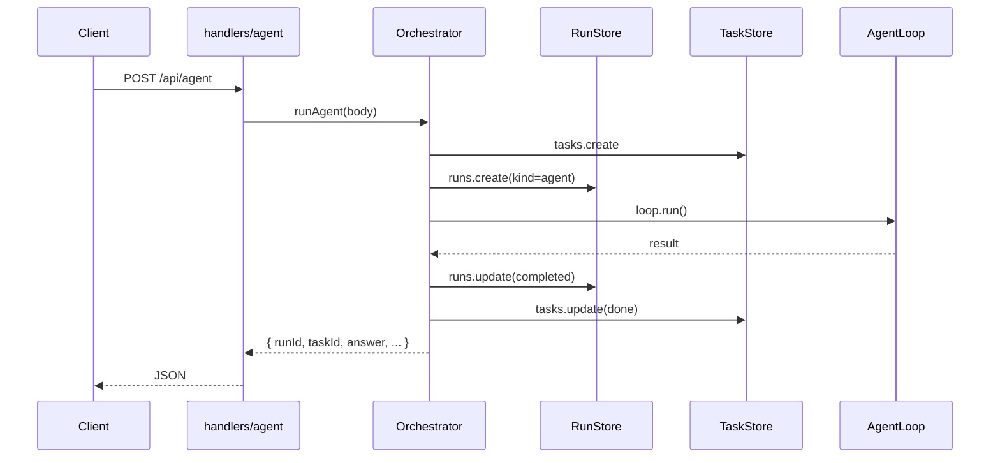

# 编排与 Run 模型

本文说明架构重构后的**统一编排层**：如何用 `Run` 串联 Agent / Task / Chat / Plan，以及后续 todolist（DAG、流式、调度自动执行）的扩展点。

## 为什么需要 Orchestrator

重构前，`server.ts` 同时承担：

- 依赖装配（DI）
- 全部 HTTP 路由
- Agent / Task / Chat 业务逻辑

随着 M4–M8 能力增加，文件膨胀且**多套「任务」语义未打通**（Plan 步骤、SQLite `tasks` 表、后台任务、调度 goal 各走各的）。

现在分为：

```text
server/handlers/*  →  薄 HTTP 适配
Orchestrator       →  统一编排（创建 Run、写 Task、调 AgentLoop/TaskRunner）
AppContext         →  依赖容器（单例装配）
```

## 核心概念

| 概念 | 说明 |
| --- | --- |
| **Run** | 一次编排执行单元（`runs` 表），含 `kind` / `status` / `sessionId` / `taskId` |
| **Task** | 持久化任务记录（`tasks` 表），与 Run 关联 |
| **Correlation** | `runId` / `sessionId` / `taskId` / `triggerId` 写入 `runs.correlation_json`，并贯穿 trace 与 `tool_audit` |
| **TaskStep** | `task_steps` 表持久化 Plan 子任务：`objective`、`dependsOn`、`requiredContext`、`availableTools`、`expectedArtifacts`、`acceptance`（验证方式）、`priority`、权限、确认门、工具绑定、结果与错误 |
| **TaskAttempt** | `task_attempts` 表记录一次 task/dry-run 执行尝试，可关联 `runId` 与具体 `stepId` |

### 任务步骤持久化

`Orchestrator.runTask()` 在执行前把 `Plan.steps` 写入 `task_steps`，执行过程中通过 `TaskRunner.onUpdate` 同步状态，结束后写入 `task_attempts`。`PlanStep.dependsOn` 会落到 `task_step_dependencies`，为后续 DAG、并行步骤、失败续跑和单步骤重试保留结构化数据。

**计划 JSON / Markdown 分离**：真实执行须 `planId + version`（PlanStore 内已审批的 `InternalTaskPlan`）。`POST /api/task/run` 拒绝 inline `plan`；展示用 `previewMarkdown` / `PublicPlanJson`（`executable: false`）不可直接执行。见 [计划JSON与Markdown分离](计划JSON与Markdown分离.md)。

`TaskRunner` 按 `dependsOn` 构建依赖图：**依赖已完成的 pending 步骤在同一波次并行执行**；无依赖步骤默认同波并行。校验未知依赖与环路；上游 `failed`/`blocked`/`cancelled` 会向依赖方传播阻塞。某步 `blocked`（如确认门）时**继续调度其他可执行分支**；仅 `failed` 后不再启动新波次。

每次步骤状态从 `pending/running/blocked/completed/failed/cancelled/skipped` 迁移时会写入 `task_status_change` trace（`scope=step`）。当聚合后的任务状态变化时，也会写入 `scope=task` 事件，包含 `runId`、`taskId`、`sessionId`、前后状态、步骤总数与状态计数，供 `/api/trace/replay` 和后续运行报告复盘。

### 任务失败回滚（`rollbackOnFailure`）

`POST /api/task/run` 请求体可传 `rollbackOnFailure: true`（**默认 false**）。当任务以 `failed` 或 `blocked` 结束且非 dry-run 时，`Orchestrator` 会：

1. 从 `tool_logs` 按 `request_id = runId` 收集本次 Run 内成功的 `write_file` / `apply_patch` 的 `changeId`（时间正序）；
2. 逆序调用内置 `rollback_change` 恢复文件；
3. 在 HTTP 响应与 `runs.result_json` 中附带 `rollback: { attempted, restored, errors }`。

补偿逻辑在 `src/orchestrator/TaskRollback.ts`，复用工具层已有备份与 changeId，不新增专用 HTTP 工具。

### 遇不确定性回退计划模式（`fallbackToPlanOnUncertainty`）

`POST /api/task/run`（及 dry-run）可传 `fallbackToPlanOnUncertainty: true`（**默认 false**）。当执行后存在 `blocked` 或 `failed` 步骤时，`Orchestrator` 会：

1. 用 `detectTaskUncertainty` 收集阻塞/失败原因；
2. 将现场摘要作为 `context` 调用 `Planner.generatePlan` 生成 **修订计划**；
3. 在响应中附带 `modeFallback: { triggered, reasons, revisedPlan, planRunId }`，并创建 `kind=plan` 子 Run（`parentRunId` 指向本次 task run）。

全部步骤 `completed` 时不触发，避免无谓模型调用。

### Run 类型（`RunKind`）

| kind | 来源 API | 说明 |
| --- | --- | --- |
| `agent` | `POST /api/agent` | AgentLoop 自主循环 |
| `task` | `POST /api/plans/:id/execute`、`POST /api/task/run`（planId+version） | TaskRunner 真实执行 |
| `task_dry_run` | `POST /api/task/dry-run` | 干跑（可 legacy ingest plan） |
| `chat` | `POST /api/chat` | 单次对话 |
| `plan` | `POST /api/plan`、`POST /api/plans/draft` | 计划生成（预览，非可执行体） |
| `scheduled` | 调度器（预留） | 触发待执行 Run |

## 数据流



## HTTP API

| 方法 | 路径 | 说明 |
| --- | --- | --- |
| GET | `/api/runs` | 最近 Run 列表 |
| GET | `/api/runs/{id}` | 单个 Run 详情 |

Agent/Task/Chat 响应体现在包含 `runId`（及 `taskId`）。

## 模块路径

```text
src/
  app/createAppContext.ts    # DI 容器
  core/                      # RunKind、CorrelationContext
  orchestrator/
    Orchestrator.ts          # 编排入口
    RunStore.ts              # runs 表
  policy/                    # Workspace / Shell / Permission 策略
  server/
    createHttpServer.ts      # 路由表
    handlers/*.ts            # 按域拆分
    http/                    # sendJson、readBody、静态文件
```

## 后续扩展点（todolist）

以下能力应**优先加在 Orchestrator**，而非 `server.ts`：

1. **调度自动执行** — Scheduler 触发 → 创建 `scheduled` Run → 无人值守时进入 AgentLoop
4. **通知合并策略增强** — 已有 `dedupeKey`/`mergeKey` 基础，后续补跨批次合并 UI

## 自检

```bash
npm run test:orchestrator   # RunStore / TaskStore / dry-run / rollbackOnFailure
```
