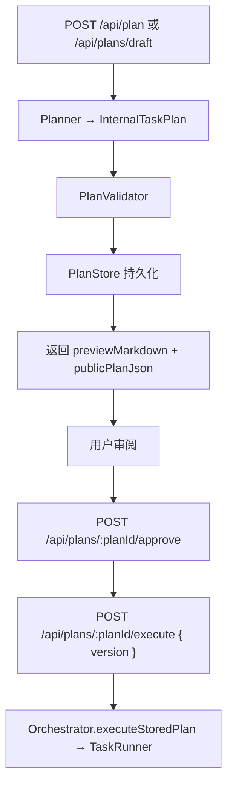

# 计划 JSON 与 Markdown 分离

本文说明 AgentRelay 如何把**内部可执行计划**与**用户展示计划**分离，避免 Markdown 或导出 JSON 被误当作执行依据。

## 核心原则

```text
内部执行：InternalTaskPlan JSON（PlanStore）
用户展示：UserPlanMarkdown / PublicPlanJson（executable: false）
执行器只认 planId + planVersion，且计划须已审批
```

| 对象 | 用途 | 能否直接执行 |
| --- | --- | --- |
| `InternalTaskPlan` | 任务调度、工具参数、审计 hash | 是（经 PlanStore + 审批） |
| `UserPlanMarkdown` | 测试台 / 文档展示 | 否 |
| `PublicPlanJson` | 导出、分享、修订输入 | 否（`executable: false`） |

外部输入（用户粘贴 JSON、导入预览、前端展示体）**永远不能**跳过 Planner → Validator → Approval 直接进 Executor。

另有一类容易混淆的“计划”：**给用户看的计划分析报告**。这类输出可以是 Markdown，应走 `/api/agent` 并传入 `mode=plan`；`/api/plan` 只服务于机器计划草案，遇到 `# 计划模式分析结果` 这类报告模板会返回 `PLAN_REPORT_REQUEST`，不会再继续调模型后报 JSON 解析失败。

进一步的三类计划边界见 [计划体系分离](计划体系分离.md)：`AgentStepPlan` 只进 trace，`UserVisiblePlan` 只供用户审阅和编译，`InternalTaskPlan` 才是唯一可执行源。

## 模块与分层

```text
agent-relay/src/plan/
├─ types.ts              InternalTaskPlan / PublicPlanJson / 状态枚举
├─ planHash.ts           planHash 计算与挂载
├─ planConverter.ts      legacy Plan ↔ InternalTaskPlan
├─ PlanValidator.ts      schema、工具、路径、预算、hash
├─ PlanRenderer.ts       Markdown / PublicPlanJson（脱敏，无完整 tool args）
├─ PlanStore.ts          SQLite 持久化（task_plans 等表）
├─ PlanApprovalManager.ts
├─ PlanService.ts        门面：draft / ingest / import-preview / loadExecutable
└─ index.ts
```

`Planner` 仍负责调模型生成 legacy `Plan`；`PlanService` 将其转为 `InternalTaskPlan` 并写入 PlanStore，同时生成预览。

## 推荐执行流程



### 修订 / 导入

用户修改 `PublicPlanJson` 或 Markdown 摘要后：

```http
POST /api/plans/import-preview
{ "preview": { ... }, "goal": "可选新目标", "planId": "可选，保留版本链", "baseVersion": 1 }
```

系统会生成**新版本** InternalTaskPlan（`origin: import_preview` 或 `revision`），指定 `planId` 时旧版本标记 `superseded`，仍需重新审批才能执行。

自然语言修订：

```http
POST /api/plans/:planId/revise
{ "baseVersion": 1, "revisionRequest": "把第 2 步改成先写测试" }
```

## HTTP API 摘要

| 方法 | 路径 | 说明 |
| --- | --- | --- |
| POST | `/api/agent` + `mode=plan` | 给用户看的只读计划分析报告，可输出 Markdown |
| POST | `/api/plans/analyze` | 生成并持久化 UserVisiblePlan（Markdown + TodoList），不可直接执行 |
| POST | `/api/plans/:userVisiblePlanId/compile` | 将用户确认的 Todo 编译为待审批 InternalTaskPlan 草案（**语义编译**：Planner 可执行计划 + `planToolBinder` 兜底绑定 tool/args） |
| POST | `/api/plans/:userVisiblePlanId/activate` | **Plan Activation**：compile →（条件允许时 autoApprove）→ execute；支持 `dryRun` / `executionMode: static\|agent_loop` / `autoActivate` 同 analyze |
| POST | `/api/plan` | 兼容入口：生成机器计划草案并持久化，返回预览（非完整内部计划）；拒绝报告型 Markdown prompt |
| POST | `/api/plans/draft` | 同上，显式 draft 语义 |
| GET | `/api/plans/:planId/preview?format=markdown\|json` | 读取已存预览，`executable: false` |
| POST | `/api/plans/:planId/approve` | 审批 → `approved` |
| GET | `/api/plans/:planId` | 计划摘要与版本链（各 version 状态 / planHash） |
| POST | `/api/plans/:planId/revise` | 自然语言修订：同 planId 递增 version，旧版 `superseded` |
| POST | `/api/plans/:planId/reject` | 拒绝 → `rejected`（不可再 `loadExecutable`） |
| POST | `/api/plans/:planId/execute` | **仅** `{ version, autoConfirm?, ... }` |
| POST | `/api/plans/import-preview` | 外部预览 → 新修订草案 |
| POST | `/api/task/run` | **不再接受** `body.plan`（`PLAN_BODY_NOT_EXECUTABLE`） |
| POST | `/api/task/dry-run` | 仍接受 legacy `plan`（自动 ingest + 系统审批，仅干跑） |

完整字段见 [/api-docs](/api-docs) 与 [API 参考](API参考.md)。

## 安全与脱敏

- Markdown / PublicPlanJson **不包含**完整 `tool args`、敏感路径细节。
- `PlanValidator` 校验工具名是否在注册表、路径是否在 workspace 沙箱内。
- `audit.planHash`（sha256）用于检测审批后计划是否被篡改。
- 未 `approved` 的计划调用 `loadExecutable` 返回 `PLAN_NOT_APPROVED`；`rejected` 后同样不可执行。

## 测试台行为

侧栏 **「计划工作流」** 提供全流程 UI：

1. **只读分析** — `POST /api/plans/analyze` → `UserVisiblePlan`（Markdown + Todo）
2. **审阅 Todo** — 勾选待编译项，可「按修订说明重新分析」
3. **编译草案** — `POST /api/plans/:userVisiblePlanId/compile` → `awaiting_approval` InternalTaskPlan
4. **审批 / 执行** — `approve` / `reject` / `execute`（dry-run 或正式），仅传 `planId + version`
5. **版本与修订** — `GET /api/plans/:planId` 查看版本链；`POST /api/plans/:planId/revise` 自然语言修订（旧版 `superseded`）

主输入区「强制计划」仍走 `/api/agent` + `mode=plan`（只读分析报告，不直接进执行链）。机器计划草案入口展示 `previewMarkdown`；真实执行必须使用 PlanStore 中已审批版本。

## 已知缺口（后续）

- 高风险步骤在非 dry-run 下强制人工审批（当前 dry-run 仍 auto-approve legacy plan）。
- 规范 §14 专用 trace 事件名（`plan.drafted` 等），当前为泛型 `plan_event`。
- `task_plan_run_steps` 逐步执行审计表。

## 参考

- 外部设计说明：`Agent_TaskPlan_JSON_Markdown_Separation_Spec.md`（仓库外规范原文）
- 编排层：[编排与Run模型](编排与Run模型.md)
- 架构：[项目整体架构](项目整体架构.md)
