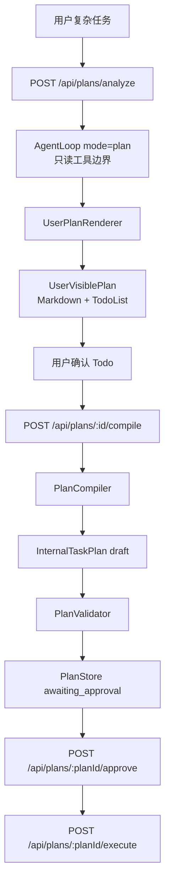

# 计划体系分离

本页对应外部规范 `Agent_Plan_System_Separation_Implementation_Spec.md`，说明 AgentRelay 当前如何区分三类计划，避免把展示内容或临时行动路线误当成执行源。

## 三类计划

| 类型 | 当前实现 | 用途 | 能否执行 |
| --- | --- | --- | --- |
| AgentStepPlan | `src/plan/types.ts` + `AgentLoop` trace `agent_step_plan` | 当前回合内部工具行动轨迹，`ephemeral=true` | 否 |
| UserVisiblePlan | `src/plan/types.ts` + `PlanStore.user_visible_plans` | 给用户看的计划模式 Markdown / TodoList | 否 |
| ExecutableTaskPlan | 现有 `InternalTaskPlan` + `PlanStore` | TaskRunner 唯一可执行计划来源 | 仅 approved 后可执行 |

核心规则：

```text
AgentStepPlan 只进 trace。
UserVisiblePlan 只供审阅和编译。
PublicPlanJson 只供展示。
TaskExecutor 只执行 PlanStore 中 approved 的 InternalTaskPlan。
```

## 数据流



`/api/plan` 和 `/api/plans/draft` 仍是机器计划草案入口，适合已经明确需要结构化执行计划的场景。主页面「计划报告」和报告型 Markdown prompt 走 `/api/agent mode=plan` 或 `/api/plans/analyze`。

## 模块职责

- `AgentLoop`：执行 ReAct JSON 工具循环；结束时把本回合工具轨迹写入 `agent_step_plan` trace，明确 `ephemeral=true`。
- `UserPlanRenderer`：把计划模式回答标准化为 `UserVisiblePlan`，提取 Todo 和风险，补充“本次仅生成计划，未修改任何文件”。
- `PlanCompiler`：只把用户确认的 Todo 编译为 `InternalTaskPlan` 草案，不执行、不审批。
- `PlanValidator`：校验内部计划 schema、依赖、工具、路径、预算、高风险审批和写操作回滚策略。
- `PlanStore`：持久化 `UserVisiblePlan` 与 `InternalTaskPlan`；执行器只从后者读取。

## API

| 方法 | 路径 | 说明 |
| --- | --- | --- |
| POST | `/api/plans/analyze` | 只读生成并保存 UserVisiblePlan |
| POST | `/api/plans/:userVisiblePlanId/compile` | 把确认 Todo 编译为待审批 InternalTaskPlan 草案 |
| POST | `/api/plans/:planId/approve` | 审批内部计划 |
| POST | `/api/plans/:planId/execute` | 执行已审批内部计划 |

## 当前边界

- `UserVisiblePlan` 可保存并编译，但编译器不会从自然语言 Todo 猜测真实工具参数；缺少明确工具绑定时会生成 manual 步骤，避免误执行。
- 真实文件修改仍应由后续更明确的执行计划生成或人工确认后进入 `approve → execute`。
- `/api/task/run` 仍拒绝 inline `plan`，防止绕过 PlanStore。

## 自检

```bash
cd agent-relay
npm run test:plan
npm run test:http-e2e
```
