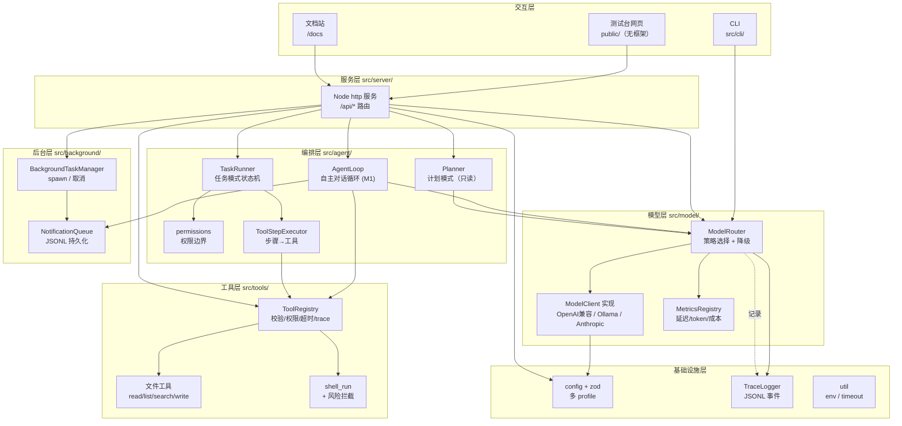
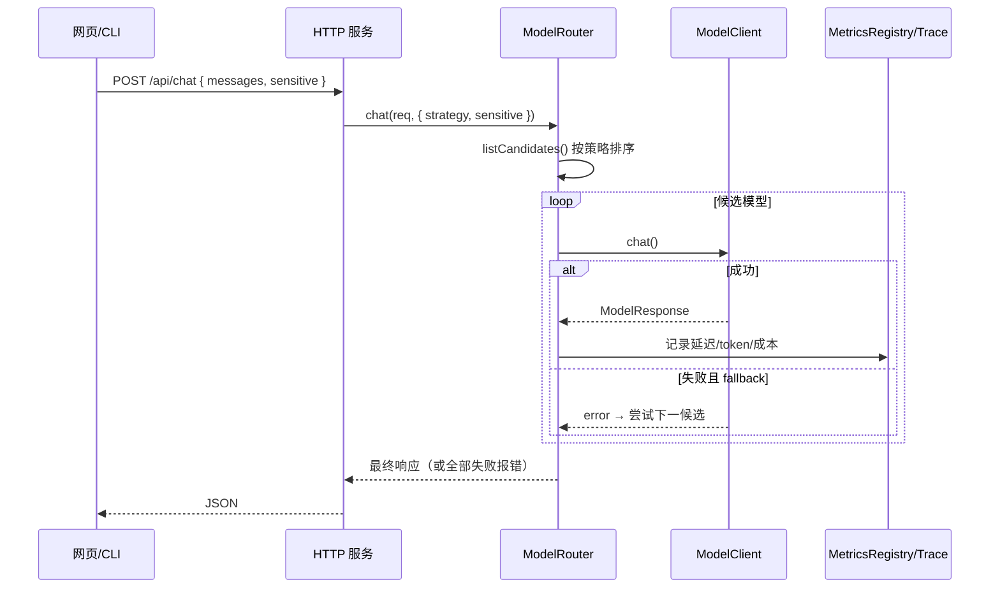
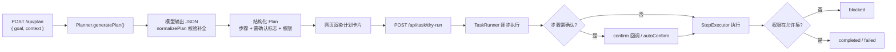
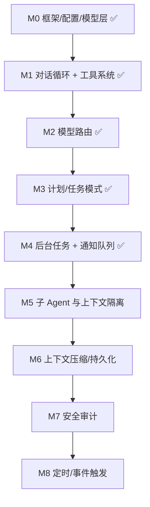

# 项目整体架构

本文给出 **AgentRelay** 项目的整体架构视图：分层设计、模块职责、关键调用链路、目录结构与里程碑路线图。新人或其他 Agent 可据此快速建立全局认知，再深入到各专题文档。

> 设计类文档（能力清单 `agent-todolist.md`、实现指南 `Agent_TS_实现指南_修订版.md`）在仓库根目录；本架构文档随代码演进持续更新。

## 一、分层总览

整个系统自上而下分为四层：**交互层 → 编排层 → 模型层 → 基础设施层**。每层只依赖其下方层，便于替换与测试。



## 二、模块职责

| 层 | 模块 | 路径 | 职责 |
| --- | --- | --- | --- |
| 交互 | 测试台网页 | `agent-relay/public/` | 无框架 HTML/CSS/JS，验证各能力的按钮面板 |
| 交互 | CLI | `agent-relay/src/cli/` | `main.ts` 框架自检、`check-models.ts` 连通性诊断 |
| 服务 | HTTP 服务 | `agent-relay/src/server/server.ts` | 暴露 `/api/*`，托管静态资源与文档站 |
| 编排 | AgentLoop | `agent-relay/src/agent/AgentLoop.ts` | 自主对话循环（M1）：模型按 ReAct JSON 协议决定工具调用，迭代至最终答案 |
| 编排 | Planner | `agent-relay/src/agent/Planner.ts` | 调模型生成**结构化计划**（目标/范围/风险/依赖/步骤），只读 |
| 编排 | TaskRunner | `agent-relay/src/agent/TaskRunner.ts` | 任务**状态机**：确认门 / 中断 / 重试 / 权限校验；执行器可插拔 |
| 编排 | permissions | `agent-relay/src/agent/permissions.ts` | `ToolPermission` 与按模式的权限边界 |
| 编排 | ToolStepExecutor | `agent-relay/src/agent/ToolStepExecutor.ts` | 把计划步骤绑定的工具交给注册表真实执行 |
| 工具 | ToolRegistry | `agent-relay/src/tools/ToolRegistry.ts` | 注册/校验/权限/超时/trace，归一化结果 |
| 工具 | 文件 / shell 工具 | `agent-relay/src/tools/*.ts` | read/list/search/write + shell_run（含命令风险拦截、路径沙箱） |
| 模型 | ModelRouter | `agent-relay/src/model/ModelRouter.ts` | 按策略选模型、失败降级、敏感任务仅本地 |
| 模型 | ModelClient | `agent-relay/src/model/*Client.ts` | 统一接口：OpenAI 兼容 / Ollama 原生 / Anthropic |
| 模型 | MetricsRegistry | `agent-relay/src/model/MetricsRegistry.ts` | 内存聚合延迟 / token / 失败率 / 成本 |
| 基础 | config | `agent-relay/src/config/` | zod 校验的多 profile 配置 + 环境变量覆盖 |
| 后台 | BackgroundTaskManager | `agent-relay/src/background/BackgroundTaskManager.ts` | 长时间命令 spawn、输出记录、取消、完成时入队 |
| 后台 | NotificationQueue | `agent-relay/src/background/NotificationQueue.ts` | 通知 JSONL 持久化；主 Agent 在安全点 drain |
| 基础 | TraceLogger | `agent-relay/src/trace/TraceLogger.ts` | 追加 JSONL 事件到 `data/traces/` |
| 基础 | util | `agent-relay/src/util/` | `env`（加载 .env）、`timeout`（超时/安全 JSON） |

## 三、关键调用链路

### 1. 对话请求（自主选择模型）



### 2. 计划模式 → 任务模式



> 当前 `StepExecutor` 为 `DryRunExecutor`（仅模拟、无副作用）。待**工具系统**就绪后替换为真实执行器，任务模式即可落地文件修改 / 命令运行 / 测试验证。

## 四、目录结构

```text
AgentRelay/
├─ agent-todolist.md              # 能力清单（设计）
├─ Agent_TS_实现指南_修订版.md     # 实现指南（设计）
├─ AGENTS.md                      # 跨 Agent 快速上手
├─ docs/                          # 说明文档（被文档站自动渲染）
│  ├─ 项目整体架构.md             # 本文
│  ├─ 接入本地模型.md
│  └─ assets/                     # 截图
└─ agent-relay/
   ├─ config/                     # default / local-only / cloud 等 profile
   ├─ public/                     # 测试台前端
   ├─ scripts/                    # 截图等脚本
   ├─ tests/                      # router / agent / tools / loop / background 自检
   └─ src/
      ├─ cli/                     # main / check-models
      ├─ config/                  # zod 类型 + 加载器
      ├─ model/                   # clients / ModelRouter / MetricsRegistry / ModelFactory
      ├─ agent/                   # AgentLoop / Planner / TaskRunner / permissions
      ├─ background/              # BackgroundTaskManager / NotificationQueue (M4)
      ├─ tools/                   # ToolRegistry / 文件与 shell 工具
      ├─ trace/                   # TraceLogger
      ├─ server/                  # 测试台后端（Node http）
      ├─ util/                    # env / timeout
      └─ types/                   # 全局共享类型出口
```

## 五、里程碑路线图



| 状态 | 说明 |
| --- | --- |
| ✅ 已完成 | 模型路由、Agent 模式、工具系统、M1 AgentLoop、**M4 后台任务与通知队列**（spawn/查询/取消、JSONL 持久化、AgentLoop 安全点消费） |
| 🚧 进行中 / 下一步 | M5 子 Agent（只读角色起步）、流式逐步推送、上下文压缩 |
| ⏳ 规划中 | 定时触发、通知去重/合并、安全审计增强 |

## 六、设计原则

- **分层单向依赖**：上层依赖下层，模型层不感知编排/服务层，便于替换与单测。
- **接口先行**：`ModelClient`、`StepExecutor` 等以接口隔离实现，新增 Provider / 执行器不动上层。
- **可观测**：所有模型调用经 `MetricsRegistry` 聚合并写入 `TraceLogger`，便于排查与成本核算。
- **安全边界**：按模式划分 `ToolPermission`，高风险步骤需显式确认，敏感任务强制仅本地。
- **零重型依赖**：服务/前端/文档站均不引框架，降低维护与理解成本。
