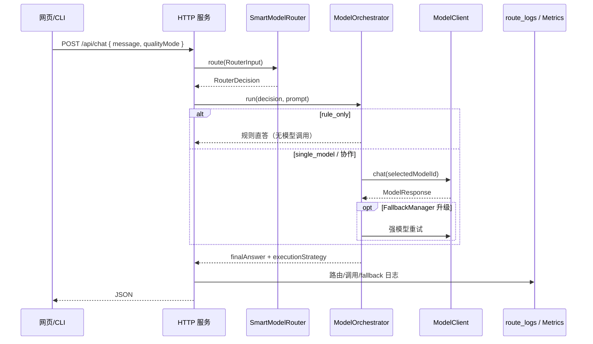
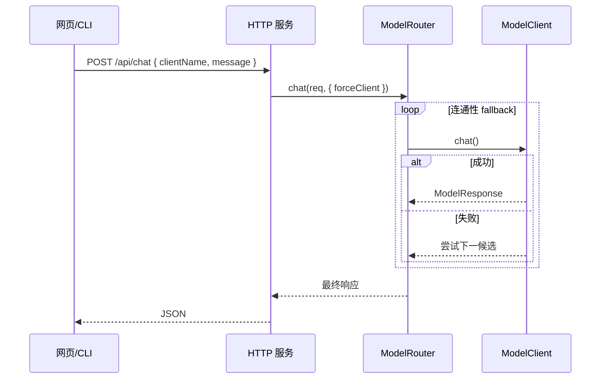
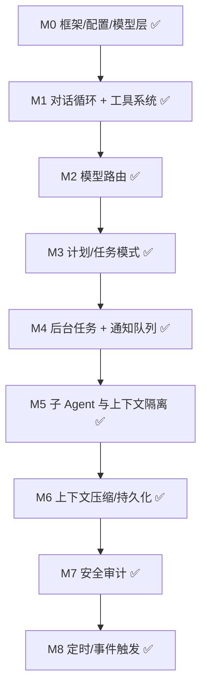

# 项目整体架构

本文给出 **AgentRelay** 项目的整体架构视图：分层设计、模块职责、关键调用链路、目录结构与里程碑路线图。新人或其他 Agent 可据此快速建立全局认知，再深入到各专题文档。

> 设计类文档（能力清单 `agent-todolist.md`、实现指南 `Agent_TS_实现指南_修订版.md`）在仓库根目录；本架构文档随代码演进持续更新。

## 一、分层总览

整个系统自上而下分为四层：**交互层 → 编排层 → 模型层 → 基础设施层**。每层只依赖其下方层，便于替换与测试。

```mermaid
flowchart TD
    subgraph UI["交互层"]
        WEB["测试台网页<br/>public/（无框架）"]
        CLI["CLI<br/>src/cli/"]
        DOCS["文档站<br/>/docs"]
        APIDOCS["API 文档<br/>/api-docs"]
    end

    subgraph APP["应用容器 src/app/"]
        CTX_APP["AppContext<br/>DI 装配"]
    end

    subgraph SRV["服务层 src/server/"]
        HTTP["createHttpServer<br/>路由表"]
        HDL["handlers/*<br/>薄 HTTP 适配"]
    end

    subgraph ORC["统一编排 src/orchestrator/"]
        OCH["Orchestrator<br/>Run 生命周期"]
        RS["RunStore<br/>runs 表"]
    end

    subgraph ORCH["Agent 执行 src/agent/"]
        LOOP["AgentLoop<br/>自主对话循环 (M1)"]
        RP["RunPolicy<br/>模式/预算/只读边界"]
        WFE["WorkflowExecutor<br/>预模型确定性工作流调度"]
        PWF["PlanWorkflow<br/>内部计划/审阅预扫描"]
        PRW["PlanReportWorkflow<br/>用户可见计划报告"]
        PCW["PlanCompileWorkflow<br/>确认 Todo 编译草案"]
        TEW["TaskExecutionWorkflow<br/>已审批计划执行入口"]
        RVF["RunVerifyWorkflow<br/>安全命令验证/静态降级"]
        PLAN["Planner<br/>计划模式（只读）"]
        TASK["TaskRunner<br/>任务模式状态机"]
        PERM["permissions<br/>权限边界"]
        TSE["ToolStepExecutor<br/>步骤→工具"]
    end

    subgraph POL["策略 src/policy/"]
        WP["WorkspacePolicy"]
        SP["ShellPolicy"]
        PP["PermissionPolicy"]
        PG["PermissionGuard"]
    end

    subgraph TOOLS["工具层 src/tools/"]
        REG["ToolRegistry<br/>校验/权限/超时/trace"]
        FT["文件/命令/git 工具<br/>patch/backup/git…"]
        LT["定位工具<br/>project_scan/locate/context_pack"]
    end

    subgraph MODEL["模型层 src/model/"]
        ROUTER["ModelRouter<br/>策略选择 + 降级"]
        CLIENTS["ModelClient 实现<br/>OpenAI兼容 / Ollama / Anthropic"]
        METRICS["MetricsRegistry<br/>延迟/token/成本"]
    end

    subgraph SUB["子 Agent 层 src/subagent/ (M5)"]
        SAR["SubAgentRunner<br/>只读角色"]
        SAC["SubAgentCoordinator<br/>并行 + 汇总/冲突检测"]
    end

    subgraph CTX["上下文层 src/context/ (M6)"]
        CM["ContextManager<br/>门面"]
        CR["ContextRestorer<br/>→ ContextPackage"]
        MR["MemoryRetriever<br/>多路评分检索"]
        SR["SemanticRetriever<br/>向量 + FTS"]
        SSB["SystemSectionBuilder"]
        PB["PromptBuilder"]
    end

    subgraph BG["后台层 src/background/"]
        BTM["BackgroundTaskManager<br/>spawn / 取消"]
        NQ["NotificationQueue<br/>JSONL 持久化 / 优先级 / 去重"]
    end

    subgraph SCH["调度层 src/scheduler/ (M8)"]
        SCHED["Scheduler<br/>once / interval / cron / event"]
        FWH["FileWatchHub<br/>chokidar"]
        GSH["GitStatusHub<br/>status 轮询"]
    end

    subgraph INFRA["基础设施层"]
        CONFIG["config + zod<br/>多 profile"]
        TRACE["TraceLogger<br/>JSONL 事件"]
        UTIL["util<br/>env / timeout"]
    end

    WEB --> HTTP
    CLI --> CTX_APP
    DOCS --> HTTP
    APIDOCS --> HTTP
    HTTP --> HDL
    HDL --> CTX_APP
    CTX_APP --> OCH
    OCH --> RP
    OCH --> LOOP
    OCH --> TASK
    OCH --> PLAN
    OCH --> RS
    OCH --> CM
    LOOP --> ROUTER
    LOOP --> REG
    LOOP --> RP
    LOOP --> PWF
    LOOP --> NQ
    LOOP --> CM
    PWF --> REG
    PWF --> LT
    PWF --> CM
    CM --> CR
    CM --> MR
    CM --> SR
    CR --> MR
    CR --> SR
    CR --> SSB
    CM --> PB
    SSB --> PB
    HTTP --> CM
    HTTP --> SAC
    SAC --> SAR
    SAR --> LOOP
    HTTP --> BTM
    HTTP --> SCHED
    BTM --> NQ
    BTM --> SCHED
    SCHED --> NQ
    FWH --> SCHED
    GSH --> SCHED
    PLAN --> ROUTER
    TASK --> PERM
    TASK --> TSE
    TSE --> REG
    REG --> FT
    REG --> POL
    POL --> WP
    POL --> SP
    HTTP --> REG
    ROUTER --> CLIENTS
    ROUTER --> METRICS
    ROUTER --> TRACE
    CLIENTS --> CONFIG
    HTTP --> CONFIG
    ROUTER -.记录.-> TRACE
```



## 二、模块职责

| 层 | 模块 | 路径 | 职责 |
| --- | --- | --- | --- |
| 交互 | 测试台网页 | `agent-relay/public/` | 无框架 HTML/CSS/JS，验证各能力的按钮面板；Agent 结果卡展示 `executionMeta.workflowType` 对应的内部处理状态 |
| 交互 | CLI | `agent-relay/src/cli/` | `main.ts` 框架自检、`check-models.ts` 连通性诊断 |
| 服务 | HTTP 服务 | `agent-relay/src/server/` | `createHttpServer` + `handlers/*` 按域路由；`server.ts` 仅入口 |
| 应用 | AppContext | `agent-relay/src/app/` | 依赖容器：模型/工具/上下文/调度/编排单例装配 |
| 编排 | Orchestrator | `agent-relay/src/orchestrator/Orchestrator.ts` | 统一 Run：Agent/Task/Chat/Plan/Scheduler；`POST /api/agent/resume` 注入 `RunState.location` 续跑定位 |
| 编排 | RunStateStore | `agent-relay/src/orchestrator/RunStateStore.ts` | 预算耗尽续跑：`run_states` 表；`location` 含 searchPlan/visitedFiles/candidateFiles 与 ProjectIndex 统计 |
| 编排 | taskGraph | `agent-relay/src/agent/taskGraph.ts` | 依赖 DAG 校验、`sortSubtasksByPriority` 拓扑+优先级排序 |
| 编排 | TaskRunner | `agent-relay/src/agent/TaskRunner.ts` | 任务**状态机**：pending→running→completed/blocked/failed/skipped；`resume(retry/skip/confirm)`；状态迁移写入 `task_status_change` trace |
| 策略 | policy | `agent-relay/src/policy/` | Workspace / Shell / Network / Permission / **PermissionGuard** / **ToolRiskAssessment**；`StructuredToolRisk` 统一高风险工具输出；`PermissionPolicy` 定义 project→mode→role→task→user 权限覆盖顺序；`PermissionGuard` 在 Agent 工具调用前输出 `allow` / `needsConfirmation` / `deny`，并生成结构化 `confirmationRequest`；删除/清空、提交/推送、远程脚本、系统环境、全局依赖、密钥读写等高风险行为在自动策略下仍强制确认 |
| 编排 | AgentLoop | `agent-relay/src/agent/AgentLoop.ts` | 自主对话循环（M1）：ReAct JSON + 工具迭代；**默认 chat 经 `createAgentChatFn` → SmartModelRouter**（显式 `clientName` 仍走 ModelRouter）；trace 含 `agent_decision` / `agent_model_turn` / `run_usage_summary` |
| 编排 | RunPolicyManager | `agent-relay/src/agent/RunPolicyManager.ts` | 消费 `IntentRouter` 的内部意图/工作流结果，解析运行模式、分项预算默认值、用户侧 `permissionPolicy` 与 systemHint；工具权限由 `permissionPolicy` 推导，`mode` 负责工作流/预算 |
| 编排 | BudgetManager | `agent-relay/src/agent/BudgetManager.ts` | 分项预算用量统计、耗尽检测、建议预算、PlanWorkflow 配额 |
| 编排 | Finalizer | `agent-relay/src/agent/Finalizer.ts` | 预算耗尽部分收尾；`taskComplexity` 估算 `suggestedToolCalls`；`completedSteps`/`missingSteps` |
| 编排 | AgentToolStep | `agent-relay/src/agent/toolStep.ts` | Agent 工具步骤；含 `resultLayers`（raw/model/user 三层） |
| 编排 | ToolResultLayers | `agent-relay/src/agent/ToolResultLayers.ts` | 工具结果分层构建 |
| 编排 | ToolResultLayers | `agent-relay/src/agent/ToolResultLayers.ts` | 工具结果分层：raw 审计、modelVisible 回灌、userDisplay 展示 |
| 编排 | RunPolicy | `agent-relay/src/agent/RunPolicy.ts` | Agent 运行模式、用户侧 `permissionPolicy` 策略、默认预算、工具权限边界与 `executionMeta` 停止原因 |
| 编排 | RunPolicyTypes | `agent-relay/src/agent/RunPolicyTypes.ts` | RunPolicy / 预算 / executionMeta 纯类型与解析函数；`executionMeta` 暴露 `modeSource`、`intent`、`workflowType`、`permissionPolicy`，供 Agent/Orchestrator 共享 |
| 编排 | IntentTypes | `agent-relay/src/agent/IntentTypes.ts` | 自动工作流内部意图与工作流类型：`answer` / `plan` / `edit` / `verify` 等纯类型 |
| 编排 | IntentRouter | `agent-relay/src/agent/IntentRouter.ts` | 统一入口意图识别：先推断 `intent`，再兼容映射到现有 `AgentRunMode`，并联动 `WorkflowRouter` / `WorkflowPlanner` |
| 编排 | WorkflowRouter | `agent-relay/src/agent/WorkflowRouter.ts` | P2 工作流路由骨架：从 `intent` 映射到 `workflowType`、执行器标识、只读/副作用类别；`answer` / `summarize` / `search` 工作流强制工具层只读 |
| 编排 | WorkflowPlanner | `agent-relay/src/agent/WorkflowPlanner.ts` | 按模式/目标/intent 选择预扫描工作流（`plan_prescan` / `edit_locate` / `generate_file_locate` / `implement_locate`） |
| 编排 | WorkflowExecutor | `agent-relay/src/agent/WorkflowExecutor.ts` | 预模型确定性工作流统一调度入口；当前挂接 `PlanWorkflow`、`EditProposalWorkflow` 与 `RunVerifyWorkflow`，向 `AgentLoop` 返回新增步骤、模型上下文和 `workflowProposals` 审计记录 |
| 编排 | PlanWorkflow | `agent-relay/src/agent/PlanWorkflow.ts` | 内部确定性只读预扫描执行器，不注册为 `ToolRegistry` 可调用工具；执行链为 `project_scan` → `locate_relevant_files` → `context_pack`（或子集），支持 edit/generate-file 预定位 |
| 编排 | EditProposalWorkflow | `agent-relay/src/agent/EditProposalWorkflow.ts` | edit/generate-file 的写入前方案阶段；不执行工具，只注入 `targetFiles` / `changeSummary` / `permissionCheck` / `diffPlan` / `verificationPlan` 约束，并生成 `executionMeta.workflowProposals` 可审计契约；`permissionChecks` 复用 `PermissionGuard` 预检 `apply_patch` / `write_file` |
| 编排 | AgentLoop 写入审计 | `agent-relay/src/agent/AgentLoop.ts` | `write_file` / `apply_patch` 成功后从 `ToolResultLayers.raw` 汇总 `path`、`changeId`、hash 与截断 diff 到 `executionMeta.workflowDiffs`，用于自动工作流写入结果审计 |
| 编排 | PlanReportWorkflow | `agent-relay/src/agent/PlanReportWorkflow.ts` | `planWorkflow` 用户报告执行器；调用只读 Agent 生成 Markdown，并通过 `PlanService.saveUserVisiblePlan` 保存 `UserVisiblePlan`，不直接生成可执行计划 |
| 编排 | PlanCompileWorkflow | `agent-relay/src/agent/PlanCompileWorkflow.ts` | `planWorkflow` 编译执行器；将已确认 `UserVisibleTodo` 编译为 awaiting_approval `InternalTaskPlan` 草案，仍需 approve 后 execute |
| 编排 | TaskExecutionWorkflow | `agent-relay/src/agent/TaskExecutionWorkflow.ts` | 已审批计划执行入口；统一封装执行与 resume 的 `TaskRunner` / `ToolStepExecutor` / `DryRunExecutor` 装配，Orchestrator 继续负责 Run/Task 持久化、回滚与 fallback |
| 编排 | RunVerifyWorkflow | `agent-relay/src/agent/RunVerifyWorkflow.ts` | `runWorkflow` / `verifyWorkflow` 内部执行器；识别白名单安全命令并通过 `shell_run` 收集输出，权限/预算/命令不满足时静态降级并向模型说明 |
| 编排 | ExplorationProgressTracker | `agent-relay/src/agent/ExplorationProgressTracker.ts` | 定位探索进度：`duplicate`/`newInformation`/`informationGain`/`lowYieldLoop`；`locate_relevant_files` 输出与 `executionMeta.location.exploration` 聚合 |
| 编排 | Planner | `agent-relay/src/agent/Planner.ts` | 调模型生成**结构化计划**并拆分子任务；默认经 `createPlannerChatFn` → `SmartModelRouter` + `ModelRegistry` 选模型（强制单模型）；指定 `clientName` 时仍走 `ModelRouter` |
| 编排 | PlanService | `agent-relay/src/plan/` | **AgentStepPlan / UserVisiblePlan / InternalTaskPlan** 分离；UserVisiblePlan 持久化、编译；InternalTaskPlan 校验、审批、预览；`PlanReportWorkflow` 负责用户报告入口，Executor 仅认 planId+version |
| 编排 | 任务 HTTP | `GET /api/tasks/:id`、`POST .../resume` | 查询步骤状态与人工接管恢复执行 |
| 编排 | permissions | `agent-relay/src/agent/permissions.ts` | `ToolPermission` 与按模式的权限边界 |
| 编排 | ToolStepExecutor | `agent-relay/src/agent/ToolStepExecutor.ts` | 把计划步骤绑定的工具交给注册表真实执行；为 `task_step` / `tool_audit` 生成共享 `toolCallId` |
| 工具 | ToolRegistry + 本地工具 | `agent-relay/src/tools/` | 16 个内置工具 + ToolStorage 备份/日志；含 `project_index_update`、`symbol_search` 与相关文件定位工具 |
| 模型 | ModelRouter | `agent-relay/src/model/ModelRouter.ts` | **客户端层**：`config.routing.strategy` 排序 + **连通性 fallback** + 显式 `forceClient`；指定 `clientName` 时使用；不负责任务规则/协作 |
| 模型 | SmartModelRouter + FallbackManager | `agent-relay/src/model-router/` | **任务层**：关键词规则 + `routerProfile` 等级 + 协作策略 + V2 模型升级 fallback；详见 [模型路由与协作 · 双轨边界](模型路由与协作.md#双轨路由边界必读) |
| 模型 | ModelOrchestrator | `agent-relay/src/model-orchestrator/` | 执行 `rule_only` / `single_model` / `strong_model_direct` / `local_draft_remote_review` |
| 模型 | ModelClient | `agent-relay/src/model/*Client.ts` | 统一接口：OpenAI 兼容 / Ollama 原生 / Anthropic |
| 模型 | MetricsRegistry | `agent-relay/src/model/MetricsRegistry.ts` | 内存聚合延迟 / token / 失败率 / 成本 |
| 基础 | config | `agent-relay/src/config/` | zod 校验的多 profile 配置 + 环境变量覆盖 |
| 子 Agent | SubAgentRunner | `agent-relay/src/subagent/SubAgentRunner.ts` | 只读子 Agent 独立上下文与权限 |
| 子 Agent | SubAgentCoordinator | `agent-relay/src/subagent/SubAgentCoordinator.ts` | 并行派生、结构化汇总；**默认经 SmartModelRouter 选模型**（显式 `clientName` 走 ModelRouter） |
| 后台 | BackgroundTaskManager | `agent-relay/src/background/BackgroundTaskManager.ts` | 长时间命令 spawn、输出记录、可选 `timeoutMs`、取消、完成时入队 |
| 后台 | outputTypes / outputMatcher | `agent-relay/src/background/outputTypes.ts`、`outputMatcher.ts` | 输出匹配 schema/type 与匹配执行分离；BackgroundTaskRecord 只依赖共享类型，匹配器只依赖任务记录，避免后台类型循环 |
| 后台 | NotificationQueue | `agent-relay/src/background/NotificationQueue.ts` | 通知 JSONL 持久化；支持 priority / dedupeKey / mergeKey；主 Agent 在安全点 drain |
| 上下文 | ContextManager | `agent-relay/src/context/ContextManager.ts` | 门面：持久化、压缩、恢复、记忆、AgentLoop 集成 |
| 上下文 | ProjectIndex | `agent-relay/src/context/ProjectIndex.ts` | SQLite 索引表；`project_scan` / **`project_index_update`** 写入，`locate`/`symbol_search` 读取 |
| 上下文 | ModuleDependencyGraph | `agent-relay/src/context/ModuleDependencyGraph.ts` | import 边查询、`expandNeighbors` 供 locate 扩展相关文件 |
| 上下文 | ProjectSemanticIndexer | `agent-relay/src/context/ProjectSemanticIndexer.ts` | LanceDB 项目文件向量索引；`locate_relevant_files` 输出 `semanticHits` |
| 上下文 | HistoryFileRecaller | `agent-relay/src/context/HistoryFileRecaller.ts` | 摘要/记忆/RunState/近期工具召回相关文件；`locate` 输出 `historyFileHits` |
| 上下文 | SessionStore / MessageStore | `agent-relay/src/context/SessionStore.ts`、`MessageStore.ts` | 会话与消息持久化 store；从聚合 `stores.ts` 拆出，`stores.ts` 保留兼容导出 |
| 上下文 | ContextRestorer | `agent-relay/src/context/ContextRestorer.ts` | 收集 session/摘要/记忆/项目/任务，返回 `ContextPackage`（含 `taggedFragments`） |
| 上下文 | contextTags | `agent-relay/src/context/contextTags.ts` | 片段标签推断、扁平化与标签过滤 |
| 上下文 | SystemSectionBuilder | `agent-relay/src/context/SystemSectionBuilder.ts` | 动态生成结构化 `SystemSection[]` |
| 上下文 | PromptBuilder | `agent-relay/src/context/PromptBuilder.ts` | sections + 最近消息 → 模型 `ChatMessage[]` |
| 上下文 | MemoryRetriever | `agent-relay/src/context/MemoryRetriever.ts` | 固定注入 + FTS + 语义；评分公式合并去重 |
| 上下文 | SemanticRetriever | `agent-relay/src/context/SemanticRetriever.ts` | LanceDB 向量 + 摘要/消息 FTS |
| 上下文 | MemoryManager / MemoryExtractor | `agent-relay/src/context/MemoryManager.ts` 等 | 记忆写入/停用；规则抽取长期记忆 |
| 基础 | TraceLogger | `agent-relay/src/trace/TraceLogger.ts` | 脱敏后追加 JSONL 到 `data/traces/` |
| 基础 | sqliteMigration | `agent-relay/src/storage/sqliteMigration.ts` | `schema_migrations` 审计表 + `PRAGMA user_version` 递增迁移；旧库只回填既有版本并继续执行后续 DDL；`memory.db` v11、`tools.db` v1 |

数据目录与 SQLite/JSONL 职责划分见 [数据存储边界](数据存储边界.md)。

| 基础 | traceReader | `agent-relay/src/trace/traceReader.ts` | 读取/导出近期 trace 事件 |
| 基础 | answer-evaluator | `agent-relay/src/model-router/answer-evaluator.ts` | V4 规则版答案足够性评估；接入 `ModelOrchestrator` fallback |
| 基础 | model-capabilities | `agent-relay/src/model-router/model-capabilities.ts` | V5 任务类型能力矩阵；`ModelRegistry` 统一候选匹配 |
| 基础 | runtime-stats | `agent-relay/src/model-router/runtime-stats.ts` | V6 聚合路由表 + MetricsRegistry，只读 `suggestions` |
| 基础 | eval-set-runner | `agent-relay/src/model-router/eval-set-runner.ts` | V7 离线评测 RuleRouter/DecisionEngine |
| 基础 | eval-set-store | `agent-relay/src/model-router/eval-set-store.ts` | `model_eval_runs` / `model_eval_results` 持久化 |
| 基础 | eval-set-types | `agent-relay/src/model-router/eval-set-types.ts` | EvalSetCase / Result / Summary / Scope 纯类型；runner/defaults/store 共同依赖，避免评测集模块循环 |
| 基础 | context-analyzer | `agent-relay/src/model-router/context-analyzer.ts` | V8 P0：路由前多信号（复杂度/上下文压力/等级 bump/协作建议） |
| 基础 | runtime-stats-feedback | `agent-relay/src/model-router/runtime-stats-feedback.ts` | V8 P2：运行指标只读反馈，候选降权排序 |
| 基础 | cost-budget-manager | `agent-relay/src/model-router/cost-budget-manager.ts` | V8 P4：成本预算友好候选排序 |
| 基础 | model-profile-store | `agent-relay/src/model-router/model-profile-store.ts` | V8 P5：ModelProfile 统一存储、能力矩阵快照与运行指标 hints |
| 基础 | redact | `agent-relay/src/util/redact.ts` | 密钥/敏感字段脱敏（M7） |
| 基础 | util | `agent-relay/src/util/` | `env`、`timeout`、`redact` |

## 三、关键调用链路

### 1. 对话请求（`POST /api/chat`，默认 Smart 路由）

未指定 `clientName` 时走 **SmartModelRouter + ModelOrchestrator**；显式 `clientName` 时绕过 Smart，走 **ModelRouter 连通性 fallback**。双轨职责见 [模型路由与协作 · 双轨边界](模型路由与协作.md#双轨路由边界必读)。



### 1b. 显式 clientName（ModelRouter 客户端层）



### 2. 计划报告 → 编译 → 任务模式

```mermaid
flowchart LR
    A["POST /api/plans/analyze"] --> B["AgentLoop mode=plan<br/>只读扫描"]
    B --> C["UserVisiblePlan<br/>Markdown + TodoList"]
    C --> D["用户确认 Todo"]
    D --> E["POST /api/plans/:userVisiblePlanId/compile"]
    E --> F["PlanCompileWorkflow → InternalTaskPlan draft"]
    F --> G["PlanValidator + PlanStore"]
    G --> H["POST /api/plans/:planId/approve"]
    H --> I["POST /api/plans/:planId/execute"]
    I --> J["TaskExecutionWorkflow"]
    J --> J2["TaskRunner 逐步执行"]
    J2 --> K{"步骤需确认?"}
    K -- 是 --> L["confirm / autoConfirm"]
    K -- 否 --> M["ToolStepExecutor"]
    L --> M
    M --> N{"权限在允许集?"}
    N -- 否 --> O["blocked"]
    N -- 是 --> P["completed / failed"]
```



> **执行边界**：`AgentStepPlan` 只进 trace；`UserVisiblePlan` / `PublicPlanJson` 不可直接执行；`POST /api/task/run` 不再接受 inline `plan` JSON；dry-run 仍兼容 legacy `plan`（自动 ingest）。详见 [计划体系分离](计划体系分离.md) 与 [计划JSON与Markdown分离](计划JSON与Markdown分离.md)。

> 任务真实执行经 `Orchestrator.runTask` → `TaskExecutionWorkflow` → `TaskRunner`（`dependsOn` DAG 波次并行）→ `ToolStepExecutor` → `ToolRegistry`；干跑使用 `DryRunExecutor`。Plan 步骤会同步到 `task_steps` / `task_step_dependencies`，每次执行尝试写入 `task_attempts`，步骤与聚合任务状态变化写入 `task_status_change` trace。请求体 `rollbackOnFailure: true` 时，失败/blocked 会经 `TaskRollback` 逆序调用 `rollback_change` 补偿文件变更。

## 四、目录结构

```text
AgentRelay/
├─ agent-todolist.md              # 能力清单（设计）
├─ Agent_TS_实现指南_修订版.md     # 实现指南（设计）
├─ AGENTS.md                      # 跨 Agent 快速上手
├─ docs/                          # 说明文档（被文档站自动渲染）
│  ├─ 项目整体架构.md             # 本文
│  ├─ 编排与Run模型.md            # Orchestrator / Run
│  ├─ API参考.md
│  ├─ 接入本地模型.md
│  └─ assets/                     # 截图
└─ agent-relay/
   ├─ config/                     # default / local-only / cloud 等 profile
   ├─ public/                     # 测试台前端 + api-spec.json + api-docs.html + vendor/
   ├─ scripts/                    # 截图等脚本
   ├─ tests/                      # router / agent / tools / loop / background / subagent / context
   └─ src/
      ├─ app/                     # AppContext DI 容器
      ├─ core/                    # RunKind、CorrelationContext
      ├─ orchestrator/            # Orchestrator + RunStore + RunStateStore
      ├─ cli/                     # main / check-models
      ├─ config/                  # zod 类型 + 加载器
      ├─ model/                   # ModelRouter / clients
      ├─ agent/                   # AgentLoop / IntentRouter / WorkflowRouter / WorkflowExecutor / PlanWorkflow / EditProposalWorkflow / PlanReportWorkflow / PlanCompileWorkflow / TaskExecutionWorkflow / RunVerifyWorkflow / RunPolicyManager / RunPolicyTypes / BudgetManager / Planner
      ├─ plan/                    # InternalTaskPlan / PlanStore / 预览与审批
      ├─ background/              # BackgroundTaskManager / NotificationQueue
      ├─ subagent/                # SubAgentRunner / Coordinator
      ├─ context/                 # ContextManager / 记忆 / 压缩
      ├─ scheduler/               # Scheduler / 事件触发
      ├─ tools/                   # ToolRegistry + 本地工具 + mock 测试辅助
      ├─ trace/                   # TraceLogger、traceReader、traceQuery、runReport
      ├─ storage/                 # sqliteMigration、memory/tools DB 迁移定义
      ├─ server/                  # createHttpServer + handlers + http
      │  └─ server.ts             # 入口（~30 行）
      ├─ util/
      └─ types/
```

## 五、里程碑路线图



| 状态 | 说明 |
| --- | --- |
| ✅ 已完成 | M0–M8 里程碑；**架构重构**：AppContext + Orchestrator + policy + server 拆分 |
| 🚧 下一步 | 模型 token 流式、通知跨批合并 UI、多模型协作 |
| ⏳ 规划中 | 插件化工具、多模型协作、HTTP E2E |

## 六、设计原则

- **分层单向依赖**：上层依赖下层，模型层不感知编排/服务层，便于替换与单测。
- **接口先行**：`ModelClient`、`StepExecutor` 等以接口隔离实现，新增 Provider / 执行器不动上层。
- **可观测**：所有模型调用经 `MetricsRegistry` 聚合并写入 `TraceLogger`，便于排查与成本核算。
- **安全边界**：按模式划分 `ToolPermission`，高风险步骤需显式确认，敏感任务强制仅本地。
- **零重型依赖**：服务/前端/文档站均不引框架，降低维护与理解成本。
